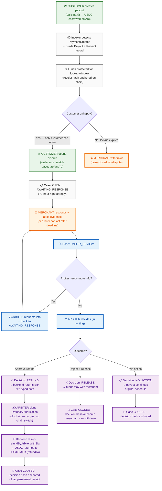

# Finné

**Dispute resolution infrastructure for stablecoin payouts.** Finné sits *above* Circle's Refund Protocol, running on Arc testnet. An entry for the Encode Programmable Money Hackathon (DeFi track).

A stablecoin payment records that one wallet sent USDC to another — it does not record *why*, and there is nowhere to resolve a dispute about it. Finné is that place: it registers a payout against the work it was for, holds a shared case record both sides can read, runs deterministic checks that flag what's on file and what's missing, records a human decision in writing, and anchors every step as a verifiable hash. Finné never holds funds, never decides by machine, and never moves money. It is the record, not the rail.

---

## Roles

Finné uses standard-commerce nomenclature. **The customer pays; the merchant gets paid; the arbiter decides.**

| Role | Who they are | What they can do |
|------|--------------|------------------|
| **Customer** | The payer (e.g. *Northstar Creators*). Funds the payment. | Creates payouts (`pay()`), **opens disputes** (the *only* role that can), adds evidence. A refund returns money **to the customer**. |
| **Merchant** | The payment recipient (e.g. *Maya Santos*). Receives the payout. | Responds to disputes, adds evidence, withdraws once the lockup ends. **Cannot** open a dispute. |
| **Arbiter** | The neutral decision-maker (e.g. *Dana Whitfield*). | Reviews the case, requests more information, decides (approve refund / reject & release), and signs the on-chain refund. |
| **Platform** | Read-only marketplace observer (e.g. *Parkline*). | Views cases and payouts. No write actions. |

> **Why "customer initiates"?** A refund, by definition, returns money to the person who paid. So the party who can raise a dispute is the **customer** (the payer). The merchant can only respond. The arbiter never initiates — they only decide.

---

## The dispute → refund flow



### Key invariants enforced in code

- **Only the customer opens a dispute.** The `case:open` permission lives on the `customer` role alone (`backend/src/rbac.ts`).
- **The customer can only dispute their own payments.** The dispute endpoint verifies `caller.wallet === payout.refundTo` (`backend/src/routes/payouts.ts`).
- **Money never moves through Finné.** USDC lives in Circle's Refund Protocol (C1). The arbiter signs an off-chain EIP-712 authorization; the backend relays `refundByArbiterWithSig` — the contract releases funds directly to the customer's `refundTo` address.
- **Only hashes go on-chain.** Receipt, case, and decision hashes are anchored in the Case Registry (C2). Names, evidence, and reasons stay off-chain.
- **Decisions are append-only and permanent.** A decision, once recorded and anchored, cannot be silently edited.

---

## Principles

1. **Finné registers and explains. It never holds funds and never signs to move money.** Finné's servers and agent are read-only against the chain at all times.
2. **A human arbiter decides.** The arbiter reads the case, chooses the outcome, and signs any on-chain action from their own wallet. There is no automatic-decision button anywhere in the product.
3. **Both sides see the same evidence.** The case room is one shared record. No hidden fraud score, no one-sided file.
4. **Only hashes and identifiers go on chain.** Receipt, case and decision hashes are anchored in the Case Registry; content (names, amounts, evidence, reasons) stays off chain.
5. **Every payment ends with a receipt and a right of reply.** The receipt links the on-chain transfer to the work, terms, evidence and — if disputed — the decision and its reasons. Records are append-only; corrections are new records, never silent edits.

---

## Architecture

| Component | Purpose |
|---|---|
| **C1 · Refund Protocol** | Circle's escrow rail — the layer Finné sits *above*. USDC only ever moves here. Hardened in this fork: drain fix, reentrancy guard, and the new `refundByArbiterWithSig` signature-refund path. |
| **C2 · Case Registry** | Finné's own contract. AccessControl roles (admin/platform/reviewer/agent), on-chain dispute lifecycle enforcement, anchors receipt/case/decision hashes against a payment ID. Events only — no token-transfer code, no payable functions. |
| **C3 · Indexer** | Watches C1 and C2 events over the Arc RPC; converts chain events into database records and status changes. |
| **C4 · Backend + database** | Receipts, work orders, evidence, cases, responses, decisions, policies, address book. REST API + JWT auth for the web app. |
| **C5 · Proof Agent** | Deterministic checks plus evidence assembly. Runs on payment detected and on dispute opened. Holds no keys, renders no verdict. |
| **C6 · Web app** | The product screens. Arbiter signing via injected browser wallet (MetaMask / Rabby) on Arc testnet. |

**Key custody, stated once.** USDC moves only inside C1, called by user-held wallets: the customer's wallet calls `pay`, and the arbiter's own wallet signs any refund authorization. Finné holds exactly one key — the registry operator key — which can only anchor hashes to C2 and physically cannot move USDC. Backend, agent, and indexer refuse to boot if a money-moving key appears in their environment.

---

## The agentic layer

The agent is a **junior clerk**: it gathers the papers, puts them in order, and writes the list of questions the case turns on. It never signs anything, never gives a verdict, and never touches money. A person does all three.

- **Where it runs:** on Finné-controlled machines with open weights. Inference is a self-hosted OpenAI-compatible HTTP endpoint — **vLLM on an AWS GPU** (production) or **Ollama** on the build laptop (dev). **No case content is sent to an external model API.** The backend boot-fails if any external model vendor key is present (FIN-102).
- **Served model:** `Qwen/Qwen2.5-3B-Instruct` (~3B params, fits a single L4/A10G). The weights are **baked into the Docker image at build time** (`model/Dockerfile`).
- **What it may produce:** the turning questions the case turns on (citing clauses + findings), and a one-paragraph narrative summary. Everything else in the decision frame — outcome requirements, unresolved items, deterministic checks — is template-authored or computed by code, not generated by the model.
- **What it may never do:** render a verdict, mark an outcome correct, hold keys, sign, or be required for the loop. Every model call has a 5-second hard timeout and a defined degrade path; CI proves the full demo loop passes with the model permanently unplugged.

---

## Repository layout

```
arc-hackathon/
├── contracts/refund-protocol/   Foundry project (submodule — C1 + C2 + deploy scripts)
│   ├── src/
│   │   ├── RefundProtocol.sol       C1 — Circle's escrow rail (hardened + refundByArbiterWithSig)
│   │   └── FinneCaseRegistry.sol    C2 — Finné's hash-anchor + dispute lifecycle contract
│   ├── script/                      Deploy.s.sol, DeployContracts.s.sol (Arc-safe), PayTranches.s.sol
│   └── test/                        87 tests: Circle's suite + finne money-path + reentrancy
├── packages/                    Shared workspace packages (consumed as source, no build step)
│   ├── domain/                  roles, states, events, opaque IDs, micro-USDC, schemas (zod)
│   └── config/                  Zod-validated typed env loader + deployment manifests
├── backend/                     Express REST API over MongoDB (C4), indexer + anchor worker
│   └── src/
│       ├── routes/               auth, payouts, cases, briefs, workorders, wallet, addressBook,
│       │                         notifications, timeline, public, internal
│       ├── registrar/            frame assembly, turning questions, narrative, model client
│       ├── proof/                deterministic check engine
│       ├── integrations/         Circle wallet service + pluggable storage (local / S3+SQS)
│       ├── indexer.ts            C3 — chain event watcher
│       ├── anchorWorker.ts       posts C2 hash anchors with the operator key
│       └── env.ts                Zod-validated config + boot-fail guards (money keys, vendor keys)
├── web/                         React + Vite SPA (C6)
│   └── src/screens/             Ledger, NewPayout, Receipt, CaseRoom, Decision, Disputes,
│                                RecipientHome, Platform, Login
├── model/                       Pre-baked vLLM Docker image (weights baked in at build time)
├── infra/cdk/                   AWS CDK stacks: FinneStack (Fargate + S3 + SQS + KMS) + FinneModelStack (GPU EC2)
├── scripts/                     dev.sh, demo.sh, deploy-arc.sh, model-bake.sh
├── docs/                        adr/, scope/, security/, models.md, architecture.md
└── .env.example                 deployment env (placeholders only — real secrets stay local)
```

---

## Tech stack

- **Contracts** — Solidity ^0.8.24, Foundry (forge), OpenZeppelin (AccessControl, EIP-712, IERC20). The audited set is Circle's; Finné's additions harden the drain + reentrancy paths and add the signature-refund path (see `contracts/refund-protocol/README.md`).
- **Backend** — Node 22 / TypeScript, Express 4, MongoDB (Mongoose 8), JWT (`jsonwebtoken` + `bcryptjs`), Viem (read-only chain client + anchor worker). Runs via `tsx` (no compile step).
- **Web** — React 18, Vite 5, React Router, Viem (browser wallet). No UI framework — inline styles matching the prototype.
- **Model** — vLLM v0.7.3 (production, NVIDIA GPU) / Ollama (dev, Mac). OpenAI-compatible endpoint; the backend's model client is identical across both.
- **Infra** — AWS CDK (ECS Fargate, S3, SQS, KMS, Secrets Manager, EC2 GPU for vLLM).
- **Chain** — Arc testnet (chain id `5042002`), native USDC (6 decimals).

---

## Getting started

The database starts **empty** — there is no seed step. The monorepo resolves all packages with one `npm install` at the root. Requires **Node 22** (see `.nvmrc`).

### Option A — One-command local dev (recommended)

```bash
npm install               # resolves backend + web + packages/*
./scripts/dev.sh          # starts MongoDB + backend (:4000) + web (:5173)
```

All services run against local implementations — **no AWS/Circle/Arc credentials needed** for the core product loop.

### Option B — Docker

```bash
cp .env.example .env            # fill in MONGO_URL (+ contract addresses + operator key)
docker compose up --build       # web on :5173, backend on :4000
```

To run the model locally (requires an NVIDIA GPU):

```bash
docker compose --profile gpu up --build   # builds the pre-baked vLLM image, adds healthcheck
```

The web container (nginx) proxies `/api/*` → the `backend` container. Health check: `curl http://localhost:4000/healthz` → `{"ok":true}`.

### Option C — host dev (each service in its own shell)

```bash
# backend
cd backend && cp .env.example .env && npm install && npm run dev    # :4000

# web (separate shell)
cd web && npm install && npm run dev                                # :5173, proxies /api → :4000
```

### Using the app

1. Open `http://localhost:5173`.
2. **Pick a role** — Customer, Merchant, Arbiter, or Platform. Your wallet address is your identity; the backend binds one wallet to one role on first sign-in.
3. **Connect a wallet** (MetaMask/Rabby on Arc testnet).

> Without the chain configured (`REFUND_PROTOCOL_ADDRESS`, `CASE_REGISTRY_ADDRESS`, `REGISTRY_OPERATOR_PRIVATE_KEY`), the backend still boots: payouts/disputes work off-chain, and chain figures degrade to `null`. To run the full money path, deploy the contracts next.

---

## Deploying contracts (chain-first)

The app is **inert on the money side** until both contracts are deployed to Arc testnet: on-chain payouts/disputes need a real `pay()` to back them. The chain is the source of truth; the database is a projection of it.

```bash
# 1. Create the deploy-only env (gitignored; holds money-moving keys ONLY).
cp contracts/.env.deploy.example contracts/.env.deploy   # then edit

# 2. Fund the accounts at https://faucet.circle.com/ (Arc testnet).

# 3. Deploy + configure the arbiter reserve + make demo payouts.
./scripts/deploy-arc.sh
```

`deploy-arc.sh` deploys `RefundProtocol` (C1) and `FinneCaseRegistry` (C2), deposits the arbiter reserve, makes real `pay()` calls, then writes the deployed addresses + the **single** registry operator key into `backend/.env` and the root `.env`. The money-moving keys (deployer / arbiter / customer) never leave `contracts/.env.deploy`; the running backend holds only the operator key, which can anchor hashes and cannot move USDC — enforced by the boot-fail guard in `backend/src/env.ts`.

> **Note on Arc testnet + forge:** Arc's native USDC invokes an `isBlocklisted` compliance precompile that forge's local EVM simulator cannot execute. `deploy-arc.sh` works around this by deploying the contracts with `forge script` (no USDC path) and doing every USDC-touching step via `cast send` against the live chain.

---

## Tests

```bash
# Backend (Node/Vitest) — RBAC, dispute flow, evidence, agent guardrails
cd backend && npm test                # 223 tests across 20 files

# Contracts (Foundry/forge)
cd contracts/refund-protocol && forge test    # 87 tests
```

Coverage:

- **Backend**: 223 tests across 20 files — RBAC matrix (only customer can open disputes), dispute lifecycle + state machine, evidence upload/link/download RBAC, wallet-to-payout party verification, agent guardrails, frame symmetry, deterministic checks engine, the signature-refund flow, and the model-unplugged guarantee.
- **Contracts** (`contracts/refund-protocol`): 95 forge tests — 37 FinneCaseRegistry + 36 Circle upstream + 21 Finné hardening (drain fix, reentrancy, `refundByArbiterWithSig`, signature + constructor hardening) + 1 reentrancy.

---

## CI

Every push and PR runs (`.github/workflows/ci.yml`):

1. **TypeScript** — install, typecheck (`tsc --noEmit` across all workspaces), test, build.
2. **Foundry** — `forge build` + `forge test` on the contracts submodule.
3. **Secret scan** — gitleaks scans the full git history for leaked credentials.
4. **ABI quarantine** — ensures the production routes never reference legacy ABIs incorrectly.

---

## Demo scenario

**Northstar Creators** (the **customer** / payer) pays **Maya Santos** (the **merchant** / payment recipient) for milestone work. Maya delivers most of it; one tranche is contested. The full loop:

1. **Northstar (customer)** creates the payout → USDC escrowed on Arc.
2. **Maya (merchant)** delivers; the indexer builds the receipt.
3. **Northstar (customer)** opens a dispute on the contested tranche (the *only* role that can).
4. **Maya (merchant)** responds with her side and evidence within the 72-hour window.
5. The **agent's brief** flags what's on file and what's missing (no verdict).
6. **Dana (arbiter)** reviews, optionally requests more info, and decides — with written reasons both sides can read.
7. If refund is approved: Dana signs the EIP-712 `RefundAuthorization`, the backend relays it, and **USDC returns to Northstar** (the customer).
8. The final receipt carries the decision, the decider, the reasons, and the chain anchors — permanently.

The interactive prototype lives at `project/Finne Dispute resolution system.dc.html` (open in a browser, no build step).

---

## External dependencies

The product loop works end-to-end with local adapter implementations. The following credentials unlock production integrations — all documented in [`.env.example`](.env.example):

| Dependency | Env vars | What it unlocks |
|---|---|---|
| **Arc testnet wallets** | `ARC_USDC_ADDRESS`, `CASE_REGISTRY_ADDRESS`, `REFUND_PROTOCOL_ADDRESS`, role wallets | Real USDC transfers, contract deployment, chain verification |
| **Circle API** | `CIRCLE_API_KEY`, `CIRCLE_ENTITY_SECRET`, `CIRCLE_WALLET_SET_ID` | Server client, modular wallets, Gas Station |
| **AWS** | `AWS_ACCOUNT_ID`, `AWS_REGION`, `EVIDENCE_BUCKET`, `KMS_KEY_ID`, `SQS_QUEUE_URL` | S3 evidence storage, SQS job queue, KMS encryption, CDK deploy |

Until these are provided, the local implementations (`LocalEvidenceStore`, `LocalJobQueue`, JWT auth) provide the same interfaces for development and testing.

---

## Disclaimer

Circle's Refund Protocol is unaudited, carries no security guarantees, and is released for educational purposes under Apache 2.0. This build runs on Arc testnet only.

## Team

Arko Ganguli · Abhishek Sira Chandrashekar
