# Finné — Technical Product Requirements Document

## The Dispute resolution system for stablecoin payouts, on Circle's Refund Protocol

---

## 1. Document control

| Field | Value |
| --- | --- |
| Version | **2.0 — Engineering handover for the main deployment** |
| Date | 30 July 2026 |
| Status | Approved for engineering handover |
| Owner | Arko Ganguli (CEO) |
| Engineering | Abhishek Sira Chandrashekar (CTO) |
| Outsider review | Jennifer H. (readability / cold-read tests) |
| Supersedes | PRD v1.1 (29 July 2026, `Finne_PRD_v1.pdf`) and Issue List v1.1 (`Finne_Issue_List_v1.pdf`) |
| Companion documents | `docs/DECISIONS.md` (D1–D11) · `docs/addresses.md` · `contracts/vendor/PROVENANCE.md` · `README.md` |
| Repository | `FinneArcHackathon` monorepo, single baseline commit `1eb4bcc` ("Finné on Circle Refund Protocol — monorepo v0.1") |

**Audience.** The engineering team taking the v0.1 monorepo from the verified local-fork build to (a) the Arc testnet hackathon deployment (8 Aug 2026 final submission, Demo Day 20 Aug) and (b) the production "main deployment" that becomes the YC company's v1 product. Sections 1–15 specify the system **as built and verified end-to-end on 29 July 2026**. Sections 16–23 specify what must change for the main deployment, with every known gap enumerated and mapped to a workstream.

**How to read this document.** Everything stated as fact about code has been verified against the tree at commit `1eb4bcc`. File references are given as `path:line-context` so claims are checkable. Where the current build deliberately falls short of production grade (demo sessions instead of auth, no reorg handling, plaintext internal token), the shortfall is stated in place, cross-referenced to the Defect & Gap Register (Appendix E) and to the Production Hardening Roadmap (§21). Nothing in this document is aspirational without being labeled as such.

### 1.1 Delivery timeline (fixed, external)

| Date | Milestone |
| --- | --- |
| Mon 3 Aug 2026, 17:29 IST | Checkpoint 2 submitted on the Encode project page |
| Thu 6 Aug 2026 | Full loop clean on Arc testnet; stretch go/no-go (D3 presentation call) |
| Sat 8 Aug 2026 (AoE 9 Aug) | Final submission uploaded |
| Thu 20 Aug 2026 | Demo Day |
| Post-hackathon | Main deployment programme (§21) — phased, no fixed external date |

---

## 2. Executive summary

Circle built the mechanism that can refund a stablecoin payment. **Finné determines whether it should be refunded, shows why, hears both sides, and records the outcome.** One protected payout, one dispute, one human decision, one on-chain correction, one permanent receipt — running on Circle's Refund Protocol deployed **unchanged** on Arc.

The system is five services and two contracts:

- **C1 · Refund Protocol** — Circle's escrow/refund contract, vendored byte-for-byte at commit `a7ae494` and deployed unmodified. It holds the money. Finné never does.
- **C2 · FinneCaseRegistry** — Finné's own 56-line contract. Pure event emitter: anchors keccak256 hashes of receipts, cases and decisions against a payment ID. One immutable operator address may call it. It cannot touch C1.
- **C3 · Indexer** — read-only chain watcher. Polls the RPC, decodes six events, records them idempotently, and reports facts to the backend over authenticated internal HTTP. Holds no keys of any kind; refuses to boot if one appears in its environment.
- **C4 · Backend + MongoDB** — Express REST API over twelve Mongo collections. Receipts, work orders, evidence, cases, responses, decisions — with server-side state machines, an RBAC permission matrix, append-only enforcement at the model layer, and an in-process anchor worker holding the **one** key any Finné service holds: the registry operator key, which can anchor hashes and can never move USDC.
- **C5 · Proof Agent** — a separate process that reads the case over REST as a restricted `agent_service` seat, runs seven deterministic checks, and writes versioned briefs containing **findings only**. Three independent layers guarantee it can never hold a key, reach a database, or emit a verdict.
- **C6 · Web app** — React/Vite, seven screens across three seats. The reviewer's decision produces an unsigned transaction that their **own browser wallet** signs; the platform's money path never passes through Finné.

**The money path, stated once.** USDC moves in exactly two ways: the platform wallet calls `pay`, and the reviewer's arbiter wallet calls `refundByArbiter` (or the recipient calls `withdraw` after lockup). Refunds can only land at the refund address fixed at payment time. Finné's servers and agent are read-only against the chain; both service processes refuse to boot if a money-moving key appears in their environment. This is the product's central claim, and it is enforced by code, tests and CI — not by policy (§4, §16).

**State of the build (29 July 2026).** All code epics E1–E7 plus the one-command demo reset (FIN-66) are complete and verified end-to-end on the local Anvil fork, including a real signed `refundByArbiter`. 20 backend tests, 22 domain/canonical tests, 7 indexer tests, 13 agent tests and 10 Foundry tests pass in CI alongside a gitleaks secret scan. Outstanding for the hackathon: Arc testnet deployment with faucet-funded wallets (FIN-12/15) and the console proofs against live testnet (FIN-16/17/20). Outstanding for the main deployment: the hardening programme in §21.

---

## 3. Problem statement and product context

### 3.1 Problem

Businesses and platforms pay creators, contractors and sellers in USDC. The chain records that a wallet sent 100 USDC to another wallet. It does not record **why**. When a payout is wrong, short, or challenged, there is no claim, no evidence, no hearing and no record. Platforms claw money back by silent deduction. Recipients have nowhere to appeal. Every other payment rail grew a Dispute resolution system — card networks got chargebacks, banks got recalls. Stablecoins shipped without one.

Circle's Refund Protocol is the rail admitting the gap. It escrows an ERC-20 payment, fixes a refund address at payment time, and gives a named arbiter three narrow powers: hold funds for a lockup period, refund to the pre-set address, and permit early withdrawal for an agreed fee. It cannot answer the only question that matters in a dispute: **should this money move back?** It has no concept of the work, the terms, the evidence, or the recipient's side. That empty seat is Finné.

### 3.2 What Finné is — and is not

Finné supplies the reason, the process and the record: a payout receipt binding the chain transaction to a work order; a shared case room where both sides see the same evidence; a deterministic agent brief that flags inconsistencies without judging them; a mandatory written decision by a named human; and a permanent, hash-anchored final receipt. Finné is a **layer above the rail**, not a fork of it: the Case Registry anchors hashes against any refund-protocol deployment address, so later adapters (Stripe, Bridge, BVNK, a platform's own contracts) attach without changing the case system.

Finné is **not**: a custodian (it never holds funds), an arbitrator-by-machine (no automatic decision exists anywhere in the product), a fraud scorer (no hidden one-sided files), or a chain fork (C1 is deployed unchanged).

### 3.3 Positioning constraint carried from v1.1

The judge question "the platform judges its own payment" has a rehearsed answer that constrains architecture: shared evidence, mandatory written reasons, permanent record, refund address fixed at payment time — and the **neutral cross-platform arbiter-of-record is the roadmap**, named but out of scope for v1. The main deployment must not foreclose it: the arbiter address is per-platform configuration, not a protocol constant (§8.4, §21.7).

---

## 4. Product principles as enforceable invariants

The five product principles from PRD v1.1 are retained verbatim and are now stated with their **enforcement mechanisms**. A principle without an enforcement point is a wish; each row below names the code, test or process that makes the principle load-bearing.

| # | Principle | Enforcement (as built) |
| --- | --- | --- |
| **P1** | **The agent reads and explains. It never decides and never signs.** | Brief schema has no recommendation field (`packages/domain/src/entities.ts`, `AgentBrief`); `FORBIDDEN_KEY_PATTERN` rejects verdict-shaped keys recursively at every depth (`packages/domain/src/findings.ts`) → HTTP 422; Mongo `briefSchema` is `strict:'throw'`; guardrail test bans `viem`/`ethers`/`mongoose`/signing imports from the agent package outright and pins its dependency list to exactly `['@finne/domain']` (`agent/test/guardrails.test.ts`); agent boot-fails on any env var matching `/(PRIVATE_KEY\|MNEMONIC\|SEED_PHRASE\|KEYSTORE)/i`. |
| **P2** | **A human at the platform decides.** | No automatic-decision code path exists; `POST /cases/:id/decisions` requires the `case:decide` permission (reviewer seat only), a written reason ≥ 20 characters (route + Mongo `minlength`), and for refunds returns an **unsigned** transaction that only the reviewer's browser wallet can sign (§11.5, §14.6). |
| **P3** | **Both sides see the same evidence.** | `GET /cases/:id` returns one shared body assembled by `getSharedCase()`; the RBAC test asserts the response is **byte-identical** (`res.text` comparison) across reviewer, recipient and platform seats; roles gate actions, never reads (§11.2). |
| **P4** | **Money moves only through Circle's contract, only to pre-set addresses.** | `refundByArbiter` can pay only `payment.refundTo`, fixed in `pay()`; C2 has no transfer code at all; backend/agent/indexer boot-fail assertions (§16.2) plus CI secret scan keep money keys out of every service environment. |
| **P5** | **Every payment ends with a receipt and a right of reply.** | Receipt built on `PaymentCreated` detection (even with no matching work order — flagged "no work order on file"); Payout/Evidence/Decision collections are append-only at the model layer (pre-save and pre-update hooks → HTTP 409); only keccak256 hashes and identifiers go on chain; content stays in Mongo (§9). |

### 4.1 The read-only invariant (the product's central security claim)

> No Finné component can move USDC. Money moves in exactly two ways: the platform wallet calls `pay`, and the reviewer's own arbiter wallet calls `refundByArbiter` (or the recipient calls `withdraw` after lockup). Finné's servers and agent are read-only against the chain; the only Finné-held key anchors hashes to the Case Registry and can never touch the Refund Protocol.

Enforced at four independent layers (defence in depth — any single layer failing does not break the claim):

1. **Environment**: three distinct boot assertions (`backend/src/env.ts`, `agent/src/env.ts`, `indexer/src/env.ts`) refuse to start the process when key material is present (exact rules in §16.2).
2. **Code reachability**: the agent guardrail test walks every source file and fails CI if any chain/database/signing import appears; the agent's runtime dependency list is pinned to exactly one package.
3. **Contract**: `FinneCaseRegistry` contains no token-transfer code and no reference to C1 beyond an event field; its operator is `immutable` with no setter.
4. **Process**: gitleaks scans full history in CI (FIN-61); `.env.example` documents that arbiter/payer/recipient keys are browser/console-only; the demo orchestration passes the operator key **only** to the backend process line.

### 4.2 Honesty requirements (carried verbatim)

Circle's Refund Protocol is unaudited, carries no security guarantees, and is released for educational purposes under Apache 2.0. This statement appears verbatim in the README, the deck, and the video, and MUST appear in any main-deployment marketing until a production-grade audited rail is adopted (§21.7). No claim of live customers. Testnet-only until the audit posture changes.

---

## 5. Scope and phasing

### 5.1 Phase 0 — hackathon build (complete, 29 July 2026)

The seven in-scope items of PRD v1.1 §3.1, all built and verified on the local fork:

1. **Protected payout** — platform pays recipient through C1 deployed unchanged; Finné detects the payment and creates a payout receipt binding it to a work order, deliverables, deadline, payout policy and dispute deadline.
2. **Proof Agent** — read-only watcher plus evidence assembler; deterministic checks; versioned case brief; holds no keys.
3. **Dispute and right of reply** — either side opens a dispute; one shared case: allegation, terms, evidence for/against, missing items, event timeline, response window.
4. **Human decision** — reviewer chooses one of four actions: approve refund, reject refund (release), request more information (max 2), or close with no action. Approval triggers a wallet signature from the arbiter address.
5. **On-chain execution** — the signed transaction calls `refundByArbiter`. Rejection leaves funds to become withdrawable when the lockup ends.
6. **Final receipt** — decision, decision-maker, reason, timestamp, evidence bundle hash, refund tx hash and final status appended to the permanent receipt; decision hash anchored in C2.
7. **Post-escrow clawback (scenario B)** — lockup expired, recipient withdrawn: an approved refund draws the arbiter reserve, the contract records a debt against the recipient, and the next payout repays the reserve automatically at the recipient's next withdrawal. Native contract behaviour (`depositArbiterFunds`, debt registration inside `refundByArbiter`, `_settleDebt` on `withdraw`); zero contract changes. Promoted to core scope by D3.

### 5.2 Phase 1 — Arc testnet deployment (open, hackathon-critical)

| Item | Issue refs | Acceptance |
| --- | --- | --- |
| Deploy C1 + C2 to Arc testnet; faucet-fund four wallets (payer, recipient, arbiter, operator) | FIN-12, FIN-15 | Addresses recorded in `docs/addresses.md`; balances visible on the Arc explorer |
| Console proofs against live testnet: pay→refund, lockup gating, full scenario-B debt path | FIN-16, FIN-17, FIN-20 | All assertions in `contracts/script/ConsoleProofs.s.sol` pass against the Arc RPC; tx hashes recorded |
| Live-testnet rehearsal, explorer screenshots for deck/video | FIN-68 | Clean run recorded; assets filed |
| Browser-wallet live rehearsal | D11 | A wallet extension holding the arbiter key signs `refundByArbiter` from the UI on testnet; until then, the labeled simulation path stands in |
| Checkpoint 2, video, deck, README v2, final submission | E0/E8/E9 | Calendar-bound items per §1.1 |

Stretch (only if M5 clean, per Issue List load rules): **S2** Circle Wallets spike (FIN-62), **S3** LLM narrative on top of the deterministic brief (FIN-48; kill-switch semantics — on any failure the brief renders from the deterministic table alone).

### 5.3 Phase 2 — main deployment (this document's mandate)

The production programme detailed in §21. Headline workstreams: real authentication replacing seeded header sessions (the code has a documented single swap point); secrets and internal-channel hardening; indexer finality/reorg correctness; anchor worker reliability (leasing, backoff, dead-letter); data scoping and multi-tenancy; agent check corrections; managed infrastructure with observability and SLOs; Circle Wallets or equivalent custodied arbiter signing as platform-optional; compliance and audit posture.

### 5.4 Out of scope (all phases of this document)

Mainnet deployment before the audit posture changes. Custody of any funds by Finné. Fiat on/off-ramps. Billing. Notifications beyond in-app. Policy authoring tools (one seeded policy per platform in v1; templated policies enter in §21.6). Any AI arbitration. Any modification of Circle's core contract beyond deployment configuration.

---

## 6. Users, roles and the access model

### 6.1 Personas

| Role | Who | What they do in the product |
| --- | --- | --- |
| **Platform reviewer** (`reviewer`) | Operations or finance person at the paying platform; holds the arbiter wallet in their browser | Views payout ledger and receipts, reads case briefs, requests information (max 2 per case), decides disputes with mandatory written reasons, signs `refundByArbiter` |
| **Recipient** (`recipient`) | Creator, contractor or seller paid in USDC | Views own payouts and receipts, receives dispute notice, submits the reply and counter-evidence, sees the decision and its reasons, withdraws after lockup from their own wallet |
| **Platform viewer** (`platform_viewer`) | Marketplace/aggregator seat | Read-only: transactions, disputes, briefs. Decisions stay with each merchant's arbiter |
| **Proof Agent** (`agent_service`) | Finné system component (separate process) | Watches cases, assembles evidence, flags inconsistencies; findings only, no keys, no chain writes, no decisions |
| **Registry operator** (`registry_operator`) | Finné operational identity (in-process anchor worker, not a human seat) | Anchors hashes to C2. The single permission `anchor:write`. Cannot touch C1 |

### 6.2 The RBAC matrix (authoritative, `packages/domain/src/rbac.ts`)

Thirteen permissions across five roles. `can(role, permission)` is the single choke point; every mutating route names exactly one permission.

| Permission | reviewer | recipient | platform_viewer | agent_service | registry_operator |
| --- | :-: | :-: | :-: | :-: | :-: |
| `workorder:create` | ✓ | | | | |
| `workorder:read` | ✓ | ✓ | ✓ | ✓ | |
| `payout:read` | ✓ | ✓ | ✓ | ✓ | |
| `case:open` | ✓ | ✓ | | | |
| `case:read` | ✓ | ✓ | ✓ | ✓ | |
| `case:respond` | | ✓ | | | |
| `case:add_evidence` | ✓ | ✓ | | | |
| `case:request_info` | ✓ | | | | |
| `case:decide` | ✓ | | | | |
| `brief:read` | ✓ | ✓ | ✓ | ✓ | |
| `brief:write` | | | | ✓ | |
| `anchor:write` | | | | | ✓ |
| `demo:seed` | ✓ | | | | |

Deliberate asymmetries worth noting: the reviewer **cannot** respond to a case (`case:respond` is recipient-only — the platform's voice is the allegation and information requests); the agent **cannot** add evidence, respond, request info or decide; `registry_operator` has exactly one permission and no HTTP seat (the anchor worker runs in-process — the role exists so the permission model stays complete when anchoring moves out of process in §21.4).

### 6.3 Session model — demo grade, by decision D7

Sessions are **seeded, header-selected identities**, not authentication: the `x-finne-session` header names one of four hardcoded sessions (`reviewer` → Dana Whitfield · Northbeam Studios; `recipient` → Maya Reyes; `platform` → Parkline Market; `agent` → Finné proof agent, not selectable in the UI). Unknown values are ignored (→ 401 at the permission guard). No tokens, no signatures, no expiry. All seeded sessions carry `wallet: null` — the arbiter wallet lives in the browser, never in configuration.

D7 (2026-07-29): *"RBAC is an enterprise-shaped permission layer (roles, matrix, route guards) over seeded header-selected sessions; no login/IdP build for 9 Aug."* The enterprise shape is real — the matrix, guards and 401/403 semantics are production-form. The **swap point for the main deployment is exactly one function**: `resolveSession` in `backend/src/middleware.ts` maps the transport credential to a `SessionContext {sessionId, role, displayName}`; replacing header lookup with IdP-verified identity (OIDC/SAML) touches nothing downstream (§21.1).

---

## 7. System architecture

Five services, two contracts, one database. Each component has one purpose, a defined interface, and can be tested alone.

### 7.1 System context (C4 level 1)

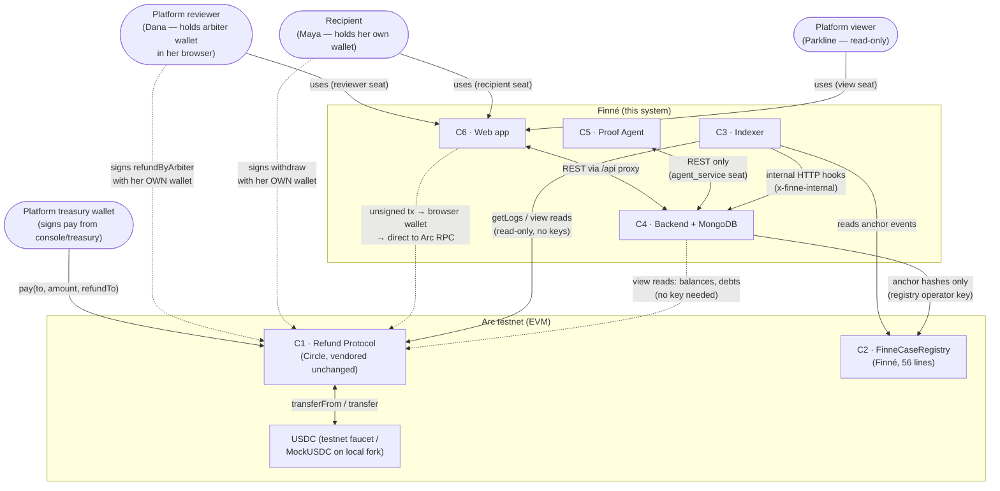

The dotted money edges are the entire money surface: `pay` (platform wallet), `refundByArbiter` (reviewer's browser wallet), `withdraw` (recipient's wallet). No solid edge from any Finné service to C1 carries a state-changing call.

### 7.2 Container diagram (C4 level 2)

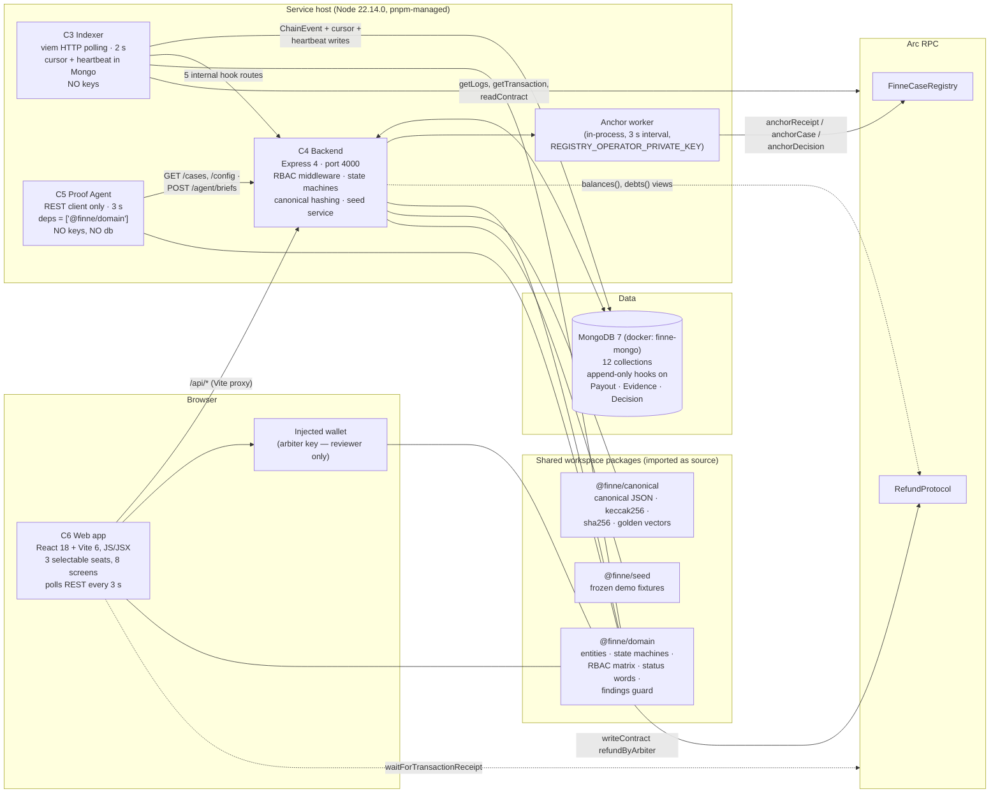

### 7.3 Component responsibility table

| Component | Purpose | Interface | Depends on | Key material |
| --- | --- | --- | --- | --- |
| C1 · Refund Protocol | Escrow, refund, withdrawal, debt. Circle's contract, deployed unchanged. Unaudited; testnet only. | `pay`, `refundByRecipient`, `refundByArbiter`, `withdraw`, `earlyWithdrawByArbiter`, `setLockupSeconds`, `depositArbiterFunds`/`withdrawArbiterFunds`, `settleDebt` + 5 events | Arc RPC, testnet USDC | Called by external wallets only |
| C2 · Case Registry | Anchors receipt/case/decision hashes against a payment ID. Proves Finné is a layer, not a fork. | `anchorReceipt`, `anchorCase`, `anchorDecision`; 3 events; zero mutable storage | Arc | `operator` (immutable) — the one Finné-held key |
| C3 · Indexer | Watches C1+C2 events over the RPC; converts chain events into database records and status hooks | Writes `ChainEvent` rows; posts 5 internal backend hooks | C1, C2, Mongo, backend | **None** (boot-fails on any `*PRIVATE_KEY*`) |
| C4 · Backend + DB | Receipts, work orders, evidence, cases, responses, decisions, policies; REST API for the web app; anchor queue | 24 REST endpoints (§11) | Mongo; C3 for chain state; Arc RPC for two view reads | `REGISTRY_OPERATOR_PRIVATE_KEY` only (money keys boot-fail) |
| C5 · Proof Agent | Deterministic checks plus evidence assembly; runs on case detection and on new evidence | Writes `AgentBrief` records via C4's REST API | C4 only (REST) | **None** (stricter pattern incl. mnemonic/keystore) |
| C6 · Web app | Seven screens; reviewer signing via injected browser wallet | Consumes C4 REST; sends signed transactions direct to the Arc RPC | C4, wallet | Arbiter key lives in the reviewer's wallet, never in the app |

### 7.4 Trust boundaries and key custody

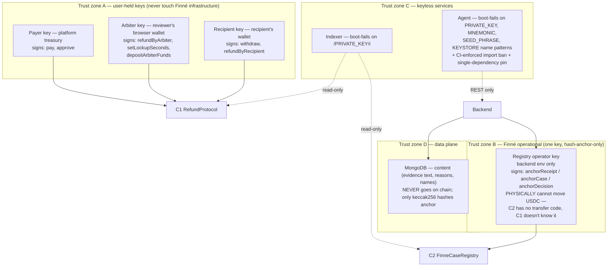

Boundary-crossing rules (normative):

1. Nothing in zone B or C may ever acquire a zone-A key. Enforced by the three boot assertions, the CI secret scan, and the demo orchestration passing keys per-process (§16.2).
2. Zone C → zone D is one-way restricted: the indexer writes only chain facts and its own bookkeeping (`chainevents`, `metas`); the agent has **no** database path at all (D8 — REST with a restricted seat, one fewer credential).
3. Chain ← zone B carries hashes and enum codes only. `anchorDecision`'s `outcome uint8` (1 refund / 2 release / 3 no action) is the maximum semantic leakage permitted on chain. No names, no amounts, no personal data (verified: C2's calldata is 3 hashes + 2 ids + 1 enum + 1 deadline across its three functions).
4. The internal channel (indexer → backend) is a separate trust axis authenticated by `x-finne-internal` shared token — demo-grade today, upgraded in §21.2.

---

## 8. Contract layer

### 8.1 C1 — RefundProtocol (vendored, unmodified)

**Provenance** (`contracts/vendor/PROVENANCE.md`): source `github.com/circlefin/refund-protocol`, commit `a7ae494b67ceae4693b416efd52f835d7b53c690` (master, 2026-06-18); files vendored: `src/RefundProtocol.sol`, `test/RefundProtocol.t.sol`, `LICENSE` (Apache-2.0, Circle Internet Group, Inc.), `README.md`, `foundry.toml`, `remappings.txt`. **Modifications: none.** Configuration happens only via constructor (arbiter, USDC token) and the arbiter-only admin functions.

> **Upstream security notice (must be tracked).** The vendored `README.md` carries Circle's own notice: an issue in the early-withdrawal function *"allows an arbiter to drain other user's payments — a fix is in development."* Root cause visible in source: `earlyWithdrawByArbiter` does **not** run `_settleDebt` and debits `balances[recipient]` against per-payment consent, so a malicious arbiter with a cooperating signature can move shared-escrow value. Finné's exposure assessment: the demo and v1 never call `earlyWithdrawByArbiter` (stretch-only in v1.1 §6.1 and not wired anywhere in the codebase), and the arbiter in v1 is the platform's own reviewer refunding the platform's own payments. For the main deployment this is a **hard gate**: adopt Circle's fixed release when published, re-vendor with a new PROVENANCE entry, and until then keep `earlyWithdrawByArbiter` administratively unused (§21.7, Risk R-1).

**Build**: Solidity `pragma ^0.8.24`, compiled with solc 0.8.28, optimizer on (200 runs), via the root profile in `contracts/foundry.toml` (remapping `refund-protocol/=vendor/src/`). Libraries pinned by clone, not submodule (D10): forge-std v1.16.2 (`bf647bd`), OpenZeppelin v5.6.1 (`5fd1781`), recorded in `foundry.lock`.

**Storage and types**:

```solidity
struct Payment {
    address to;                // recipient
    uint256 amount;            // full original amount — refunds are whole-payment only
    uint256 releaseTimestamp;  // block.timestamp + lockupSeconds[to], snapshotted at pay()
    address refundTo;          // refund destination, FIXED at payment time
    uint256 withdrawnAmount;   // set to amount on withdraw (full)
    bool refunded;
}

uint256 public constant MAX_LOCKUP_SECONDS = 15_552_000; // 180 days
IERC20  public fiatToken;                        // USDC
uint256 public nonce;                            // monotonic payment ID, starts 0
address public arbiter;                          // constructor-set; NO setter — immutable in practice
mapping(address => uint256) public lockupSeconds; // per-recipient, applied at pay() time only
mapping(uint256 => Payment) public payments;
mapping(address => uint256) public balances;     // escrow accounting; arbiter reserve shares this map
mapping(address => uint256) public debts;        // recipient owes arbiter
mapping(bytes32 => bool)   public withdrawalHashes; // EIP-712 replay guard
```

**Events**: `PaymentCreated(paymentID idx, to idx, amount, releaseTimestamp, refundTo idx)`, `Refund(paymentID idx, refundTo idx, amount)`, `RefundToUpdated(paymentID idx, old idx, new idx)`, `Withdrawal(to idx, amount)`, `WithdrawalFeePaid(recipient idx, amount)`.

**Function surface as used by Finné** (v1.1 §6.1, confirmed against source):

| Function | Caller | Use in Finné |
| --- | --- | --- |
| `pay(to, amount, refundTo)` | Platform wallet | Creates the protected payout. `refundTo` is the platform's own refund address, set at payment time. Reverts on zero `refundTo`; `transferFrom` payer → contract; credits `balances[to]`; **no return value — callers must read `nonce()` before the call to learn the payment ID** (both console scripts and the test helper do exactly this). |
| `refundByRecipient(paymentID)` | Recipient wallet | Voluntary concession path. Shown in the case room as an option for the recipient; not used in the primary demo beat. |
| `refundByArbiter(paymentID)` | Arbiter wallet (reviewer) | Executes an approved refund. **Path A** (escrow covers): debits recipient escrow, transfers full amount to `refundTo`. **Path B** (escrow short — scenario B): requires the whole amount from `balances[arbiter]` (partial coverage is never attempted), records `debts[recipient] += amount`. Unfunded reserve ⇒ `InsufficientFunds()` revert. |
| `withdraw(paymentIDs[])` | Recipient wallet | After lockup, if not refunded. **`_settleDebt(msg.sender)` runs first** — outstanding debt is netted from escrow into the arbiter balance before any transfer. The "release" outcome is a rejection of the refund claim; no arbiter transaction is required for release. |
| `earlyWithdrawByArbiter(...)` | Arbiter + recipient EIP-712 sig | Optional early payout with agreed fee. **Stretch only; never called by Finné v1** (see security notice above). |
| `depositArbiterFunds(amount)` / `withdrawArbiterFunds(amount)` | Arbiter wallet | Funds/drains the reserve that backs post-escrow refunds. Seeded (200 USDC) before the demo; surfaces as the reserve tile on the ledger. |
| `settleDebt(recipient)` | **Anyone** (permissionless) | Nets debt against the recipient's current escrow. Not called in the demo — `withdraw` settles first automatically, which is the cleaner story. |
| `setLockupSeconds(recipient, s)` | Arbiter wallet | Per-recipient lockup, default zero, capped at 180 days. Must be set before the first `pay` or there is no escrow window. Applied at `pay()` time only — existing payments keep their `releaseTimestamp`. |

**Whole-payment refunds and the tranche rule (D6).** `_executeRefund` transfers the **full** original payment amount (even if partially withdrawn — that is precisely what creates scenario-B debt); the contract has no partial refund. Finné therefore pays **one payment per deliverable**: the demo work order settles as three payments of 33.33 / 33.33 / 33.34 USDC (D5), so a dispute over one deliverable touches only that payment. Tranche isolation is proven by `test_trancheIsolation` (refunding tranche 3 leaves tranches 1–2 escrowed and unrefunded).

**The debt-path subtlety (proven in `contracts/test/DebtPath.t.sol`).** After a reserve-covered refund, the recipient's next `withdraw` only succeeds if total escrow ≥ debt + the withdrawn payment; the shortfall lands on the tail payment. In the canonical sequence (200 reserve; pay 100 → withdraw → refund draws reserve, debt 100; pay 150 + 120; withdraw 150): debt clears to 0, reserve is made whole at 200, the recipient nets 250 withdrawn with 20 left in escrow — *"the shortfall carried by the tail payment."* Engineering teams integrating payout schedulers must model this: **debt settlement is silent and automatic at the contract layer**, and the recipient's visible balance impact arrives at their next withdrawal, not at refund time.

**Access control posture**: single `onlyArbiter` modifier; no Ownable, no pause, no upgradeability, no reentrancy guard, no ERC20 return-value checks (`transfer`/`transferFrom` results unchecked — fine for USDC/MockUSDC, a known footgun for exotic tokens). All consistent with "unaudited, educational, testnet-only."

### 8.2 C2 — FinneCaseRegistry (Finné's contract, 56 lines)

Purpose: anchor receipt/case/decision hashes against a payment ID. Hashes are keccak256 of canonical JSON (§9.4). No personal data, no amounts, no names on chain. Events only; **zero mutable storage** — the contract is a pure event emitter, so its full state is reconstructible from logs alone.

```solidity
contract FinneCaseRegistry {
    address public immutable operator;              // the ONLY state; no setter, no transfer

    event ReceiptAnchored(address indexed refundProtocol, uint256 indexed paymentID,
                          bytes32 receiptHash, uint64 disputeDeadline);
    event CaseOpened(uint256 indexed paymentID, bytes32 caseHash, address openedBy);
    event DecisionAnchored(uint256 indexed paymentID, bytes32 decisionHash, uint8 outcome);
                          // 1 refund · 2 release · 3 no action

    error CallerNotOperator();
    error InvalidOutcome();

    function anchorReceipt(address refundProtocol, uint256 paymentID,
                           bytes32 receiptHash, uint64 disputeDeadline) external onlyOperator;
    function anchorCase(uint256 paymentID, bytes32 caseHash) external onlyOperator;
    function anchorDecision(uint256 paymentID, bytes32 decisionHash, uint8 outcome) external onlyOperator;
                           // reverts InvalidOutcome unless 1 <= outcome <= 3
}
```

Design notes: `ReceiptAnchored` carries the **refund-protocol address** as its first indexed field — this is the adapter seam; a later Stripe/Bridge/BVNK integration anchors against a different rail address with zero registry changes. `CaseOpened.openedBy` is `msg.sender` (always the operator in v1); it becomes meaningful when access control loosens (v1.1 §6.2: *"restrict callers to the Finné operational key for the demo; access control can loosen later"*). Known nit: the constructor takes `_operator` without a zero-address check — add one when the contract is next touched (Appendix E, GAP-C1).

### 8.3 MockUSDC (local fork only)

19-line OZ ERC20, `decimals() = 6`, **unrestricted `mint`** — acceptable strictly because it is deployed only when `USDC_ADDRESS` is unset (the local Anvil path); on Arc testnet the faucet USDC address is wired and MockUSDC is never deployed. The deploy script logs it with the explicit marker "MockUSDC (local fork only):".

### 8.4 Deployment scripts and configuration

**`Deploy` (`contracts/script/Deploy.s.sol`)** — env: `DEPLOYER_PRIVATE_KEY`, `ARBITER_ADDRESS`, `OPERATOR_ADDRESS`, `USDC_ADDRESS` (optional; unset → MockUSDC deployed + 1,000 USDC minted to payer, 500 to arbiter), `PAYER_ADDRESS` (mock branch only). Deploys `RefundProtocol(arbiter, usdc, "RefundProtocol", "1")` — note the EIP-712 domain (`"RefundProtocol"`/`"1"`) intentionally differs from upstream's test domain (`"Refund Protocol"`/`"1.0"`); any future `earlyWithdrawByArbiter` tooling must sign against **our** domain. Then `FinneCaseRegistry(operator)`. Console output uses fixed prefixes (`RefundProtocol:`, `FinneCaseRegistry:`, `USDC:`) that `scripts/demo-reset.sh` greps — treat the log format as an interface (Appendix E, GAP-O3).

**`ConfigureArbiter`** — run with the arbiter key after deploy: `setLockupSeconds(recipient, LOCKUP_SECONDS || 120)`, unlimited USDC approval to the protocol, `depositArbiterFunds(RESERVE_AMOUNT || 200e6)`. The 120 s short-lockup profile (FIN-17) is deploy-time configuration for demo speed; the contract itself is unchanged and the seeded platform policy narrates "30 days".

**`ConsoleProofs` (`contracts/script/ConsoleProofs.s.sol`)** — the milestone gates, phase-split into separate `--sig` entrypoints because real chains do not warp:

| Contract | Proof | Assertions |
| --- | --- | --- |
| `PayTranches` | D5/D6 seed: three tranche pays 33.33/33.33/33.34 | — |
| `PayRefund` | FIN-16 / M1 gate: pay 100 → `refundByArbiter` | refund landed at the fixed refund address; zero debt |
| `LockupWithdraw` (2 phases) | FIN-17: lockup gates withdrawal | withdraw **fails** inside the window; succeeds after |
| `DebtPath` (3 phases + addendum) | FIN-20 core scenario B | reserve drawn exactly, debt == 100e6, next withdrawal settles debt to 0 and makes the reserve whole; `proveUnfundedRevert` proves `InsufficientFunds` with no reserve |

**Environments and addresses**:

| Environment | Chain ID | Contract addresses | Wallets |
| --- | --- | --- | --- |
| Local fork (`make demo-reset`) | 31338, Anvil, 1 s blocks | MockUSDC `0x5FbD…0aa3` · RefundProtocol `0xCf7E…0fc9` · Registry `0xDc64…f6C9` (deterministic) | Anvil dev keys 0–3 = payer / Maya / Dana-arbiter / registry-operator (public knowledge, local only) |
| Arc testnet | recorded at FIN-12 | `docs/addresses.md` — **all `_pending_` until M1 deploy** | Four faucet-funded wallets, roles as above |
| Production (main deployment) | per adopted rail | §21.7 — audited rail + verified deployments + address registry with change control | Platform-held payer/arbiter (or Circle Wallets), Finné-held operator in KMS |

### 8.5 Contract invariants and test matrix

Foundry suites (all green in CI): `DebtPathTest` (5 tests — escrow-covered refund leaves no debt; lockup gates withdrawal with `PaymentIsStillLocked`; full scenario-B ledger assertions at every step; `InsufficientFunds` on unfunded reserve; tranche isolation), `FinneCaseRegistryTest` (5 tests — all three anchor events emit exactly as specified with the operator as opener; outcome 0 and 4 revert `InvalidOutcome`; all three functions revert `CallerNotOperator` for strangers), plus Circle's own 40-test upstream suite kept passing as vendored.

Invariants the engineering team must preserve (each is currently pinned by at least one test):

1. A refund can only ever land at `payment.refundTo` (fixed at pay time). — upstream suite + `PayRefund`.
2. Whole-payment refunds only; tranche isolation holds. — `test_trancheIsolation`.
3. A reserve-covered refund records exactly `amount` of debt; the next withdrawal settles it before funds move. — `test_debtPath_scenarioB`.
4. An unfunded reserve makes a post-escrow refund revert; nothing partial happens. — `test_debtPath_revertsWhenReserveUnfunded`.
5. Only the operator can anchor; only outcomes 1–3 are anchorable. — `FinneCaseRegistryTest`.

---

## 9. Data architecture

### 9.1 Entity-relationship model

Twelve Mongo collections. `ChainEvent` and `Meta` are shared with the indexer (its only writes); everything else is backend-owned. References are by business key (`paymentId`, `caseNumber`, `platformKey`, `recipientKey`), not ObjectId, so records remain meaningful when exported.

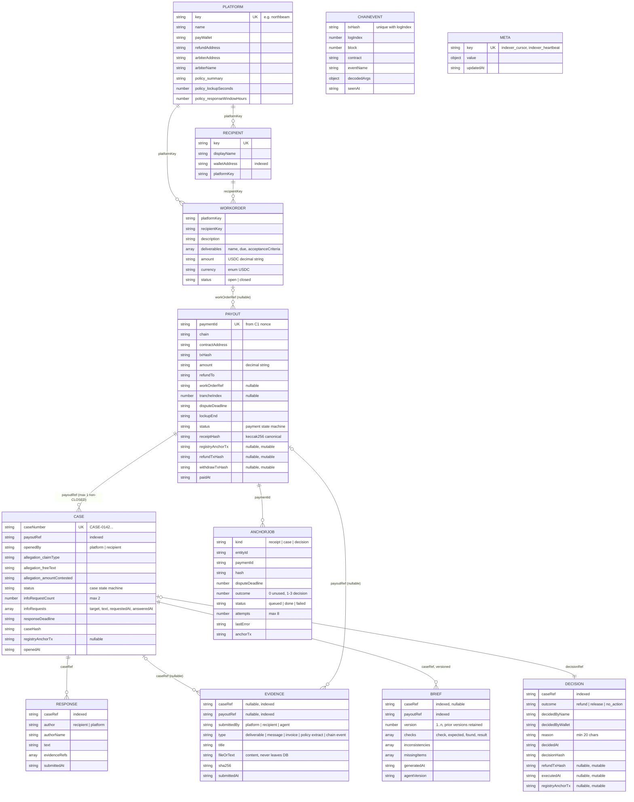

(Not shown: `Meta` has no relations; amounts are stored as **decimal strings** — `"33.34"` — with 6-decimal base-unit conversion isolated in `backend/src/usdc.ts`; ISO-8601 strings are used for all timestamps rather than Date objects, keeping canonical hashing byte-stable.)

### 9.2 Append-only enforcement (P5, PRD §13.3, FIN-30)

Three collections are append-only at the model layer — **Payout**, **Evidence**, **Decision** — via a shared `appendOnly(schema, entity, immutablePaths)` plugin:

- `pre('save')`: any modified immutable path on a non-new doc throws `AppendOnlyViolationError`.
- `pre('updateOne'/'updateMany'/'findOneAndUpdate')`: the update document is scanned recursively (descending `$` operators, matching on the root of each dotted path) and rejected if it touches an immutable path.
- `pre('findOneAndReplace')`: rejected unconditionally.
- Error surfaces as HTTP **409** with the message "…is append-only: … Corrections are added as new records, never edits (PRD §13.3)."

Immutability split (mutable fields are the lifecycle appendices, deliberately outside the guard):

| Collection | Immutable | Mutable (lifecycle only) |
| --- | --- | --- |
| Payout | paymentId, chain, contractAddress, txHash, platformKey, recipientKey, recipientWallet, amount, refundTo, workOrderRef, trancheIndex, disputeDeadline, lockupEnd, receiptHash, paidAt (15 paths) | status, registryAnchorTx, refundTxHash, withdrawTxHash, evidenceManifestHash |
| Evidence | all 8 content fields — fully immutable after create | — |
| Decision | caseRef, outcome, decidedByName, decidedByWallet, reason, decidedAt, decisionHash (7 paths) | refundTxHash, executedAt, registryAnchorTx |

Known bypass surface (must be closed operationally, not in code): `bulkWrite`, `deleteMany`, `replaceOne` and raw-driver access are not intercepted by mongoose middleware. Production posture: restrict the backend's database user to CRUD without collection-drop, forbid raw driver usage by review policy, and add DB-level schema validation in §21.3. `Case` and `Response` are intentionally **not** append-only (the state machine mutates case status; the computed timeline preserves history), and `Payout.status`/`Case.status` carry no mongoose enum — the state machines are the only guard (defence-in-depth gap GAP-B6).

### 9.3 Identity and numbering

- `paymentId` = C1's `nonce` at pay time, stringified — the universal join key across chain, DB, API and registry.
- `caseNumber` = `CASE-` + zero-padded `142 + countDocuments()` → first seeded case is always **CASE-0142**. Count-derived numbering is not collision-safe under concurrency or after deletions — replace with an atomic counter in §21.3 (GAP-B10). Brief `version` shares the same pattern.

### 9.4 Canonicalization and hashing (`@finne/canonical`, FIN-19)

The same logical value must serialize to the same bytes in every service, or anchored hashes diverge. The canonical form is:

- Objects: keys sorted lexicographically (UTF-16) **at every depth**; `undefined`-valued properties skipped ("absent and undefined are the same fact"); only plain objects allowed (class instances, Date, Map → `TypeError`).
- Arrays: order preserved.
- No whitespace. Standard JSON string escaping; unicode kept literal.
- Rejected outright: `undefined`/function/symbol/bigint as values, NaN, ±Infinity, circular references.

`canonicalHash(v) = keccak256(utf8(canonicalize(v)))` → the hash that goes on chain. `sha256Hex` fingerprints evidence payloads (file bytes or text) server-side.

**Golden-vector regime**: five frozen vectors in `packages/canonical/test/golden.json` (receipt shape, case shape, decision shape, empty object, unicode text) assert both the canonical string and the keccak256 across releases. The generator (`test/generate-golden.ts`) is run-once by design; **regenerating with different output is a breaking change to every anchored hash** and therefore to the product's verifiability claim. Treat `golden.json` as an interface frozen at v1 — any canonicalization change requires a versioned migration plan for on-chain anchors (§21.4).

**What gets hashed** (assembled in `backend/src/services.ts`):

| Hash | Input (canonical JSON of) | Anchored via |
| --- | --- | --- |
| `receiptHash` | receipt body built at payment detection (payment facts + work-order binding) | `anchorReceipt(refundProtocol, paymentID, hash, disputeDeadline)` |
| `caseHash` | `{payoutRef, openedBy, allegation, openedAt}` | `anchorCase(paymentID, hash)` |
| `decisionHash` | `{caseRef, outcome, decidedByName, decidedByWallet, reason, decidedAt}` | `anchorDecision(paymentID, hash, outcome)` — refund decisions anchor **only after on-chain confirmation** |
| evidence `sha256` | raw `fileOrText` | not anchored individually; surfaces in receipts/case room |

---

## 10. Domain state machines

Both machines live in `@finne/domain`, are pure and table-driven, and are enforced **server-side only** (the web app renders, never decides legality). Every illegal transition throws a typed error that the API maps to HTTP 409 with a plain-language message (the test suite asserts messages match `/^A payment that is /` — no SCREAMING enum names reach users).

### 10.1 Payment state machine (PRD §9.1)

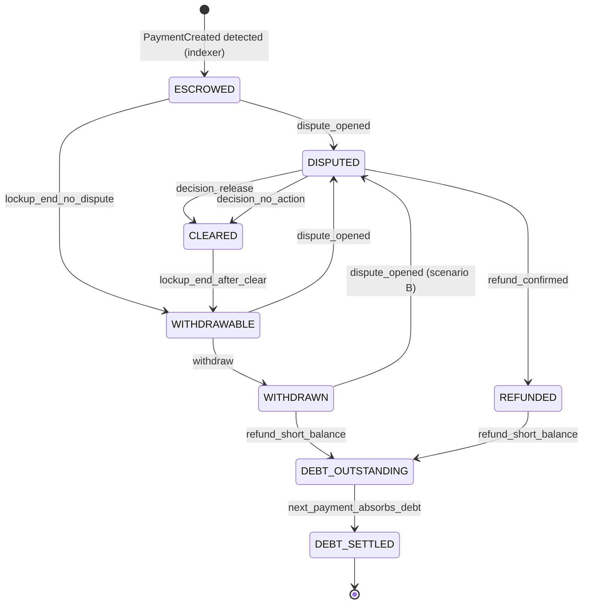

Complete transition authority table (12 legal edges; the domain test suite exhaustively asserts all 8×9−12 illegal pairs throw):

| From | Event | To | Authorized trigger |
| --- | --- | --- | --- |
| ESCROWED | dispute_opened | DISPUTED | Either side via `POST /payouts/:id/disputes` (`case:open`) |
| ESCROWED | lockup_end_no_dispute | WITHDRAWABLE | Indexer internal hook (wall-clock lockup expiry) |
| DISPUTED | refund_confirmed | REFUNDED | Indexer on `Refund` event (or labeled demo simulation, D11) |
| DISPUTED | decision_release / decision_no_action | CLEARED | Reviewer decision (`case:decide`) |
| CLEARED | lockup_end_after_clear | WITHDRAWABLE | Indexer (edge defined; **no backend route currently emits it** — GAP-B12) |
| WITHDRAWABLE | withdraw | WITHDRAWN | Indexer on `Withdrawal` event |
| WITHDRAWABLE | dispute_opened | DISPUTED | Dispute filed before withdrawal, inside window |
| WITHDRAWN | dispute_opened | DISPUTED | Scenario B: the claim lands after the money left |
| WITHDRAWN / REFUNDED | refund_short_balance | DEBT_OUTSTANDING | Indexer reports `debtRecorded=true` on refund execution |
| DEBT_OUTSTANDING | next_payment_absorbs_debt | DEBT_SETTLED | Indexer when `debts(recipient)` returns to zero |

`DEBT_SETTLED` is terminal (`legalPaymentEvents === []`, pinned by test).

### 10.2 Case state machine (PRD §9.2)

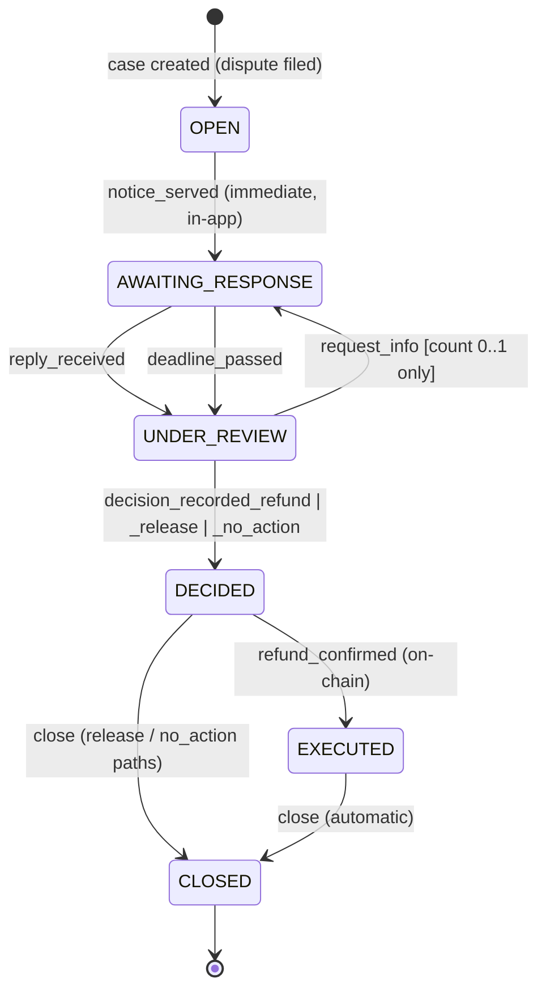

Guard semantics (state = `{status, infoRequestCount}` — the counter is part of machine state, `MAX_INFO_REQUESTS = 2`):

| Event | Guard | Failure message (verbatim, user-facing) |
| --- | --- | --- |
| `notice_served` | status OPEN | "The notice has already been served on this case." |
| `reply_received` / `deadline_passed` | status AWAITING_RESPONSE | "This case is not waiting on a reply." |
| `request_info` | status UNDER_REVIEW **and** count < 2 | "Information can only be requested while the case is under review." / "This case has already used its 2 information requests — it must now be decided." |
| `decision_recorded_*` | status UNDER_REVIEW | from AWAITING_RESPONSE: "The decision opens when the reply arrives or the window closes."; else "This case has already been decided." |
| `refund_confirmed` | status DECIDED | "There is no recorded refund decision to execute." |
| `close` | status DECIDED or EXECUTED | "A case closes only after it has been decided." |

Flow notes: refund path traverses all six states; release/no-action closes directly from DECIDED (no EXECUTED — no transaction was needed, which the UI states verbatim). Each `request_info` resets `responseDeadline` to now + the platform's response window (72 h default). The reply that answers an information request stamps `answeredAt` on the newest unanswered request.

### 10.3 Status vocabulary (single shared mapping, FIN-51)

UI wording lives in exactly one module (`statusVocabulary.ts`); no screen invents its own: payments — Protected, Disputed, Refunded, Cleared, Ready to withdraw, Withdrawn, Debt outstanding, Debt settled; cases — Opened, Awaiting response, Under review, Decided, **Refunded** (EXECUTED maps to the money word, deliberately), Closed. The web app imports these words through `@finne/domain` — its only domain import — which is how the vocabulary constraint is enforced structurally.

---

## 11. API specification (C4 backend)

Express 4, JSON body limit 4 MB, listening on `BACKEND_PORT` (default 4000). Middleware chain: `express.json` → `resolveSession` (reads `x-finne-session`) → per-route `requirePermission(p)` or `requireInternal(token)` → handler → terminal error handler.

### 11.1 Conventions

- **Auth headers**: `x-finne-session: reviewer|recipient|platform|agent` (public seats) · `x-finne-internal: <token>` (indexer-only routes; exact string compare).
- **Error envelope**: every error is `{ "error": "<plain-language sentence>" }`. Status mapping: `HttpError` → its status; illegal state-machine transition → **409**; append-only violation → **409**; brief schema violation (`ForbiddenFindingFieldError` / `InvalidBriefError`) → **422**; missing session → **401** ("Pick a session first…"); wrong role → **403** ("The {role} seat cannot do this (needs {permission})."); wrong internal token → **403** ("Internal endpoint."); everything else → **500** ("Something went wrong on our side. Nothing has changed on chain.") — the 500 copy deliberately reaffirms the money invariant.
- **Identity**: cases addressed by `caseNumber` (`CASE-0142`), payouts by `paymentId` (C1 nonce as string).

### 11.2 Endpoint reference

**Public (no session)**

| Route | Returns |
| --- | --- |
| `GET /healthz` | `{ok:true}` — liveness only, no DB |
| `GET /config` | Chain wiring (chainId, rpcUrl, explorerUrl, contract addresses), demoMode, first platform (name, arbiter, refundAddress, policy — **never `payWallet`**), first recipient |
| `GET /status` | `{indexer:{lastSeenAt,lastBlock,stale}, chain:{arbiterReserve,recipientDebt}|null, demoMode}` — `stale` = heartbeat older than **15 s**; `chain` figures are live viem view reads (`balances(arbiter)`, `debts(recipient)`) that degrade to `null` on RPC failure, never erroring the route (§13.4 resilience) |
| `GET /chain/events` | Last 12 ChainEvents, hashes and names only (demo status strip, FIN-58) |
| `GET /session` | Current seat + its permission list, or 401 |

**Work orders** — `POST /platforms/:key/workorders` (`workorder:create`, reviewer) validates description/deliverables[]/amount → 201 full doc; `GET /platforms/:key/workorders` (`workorder:read`).

**Payouts and receipts**

| Route | Perm | Behaviour |
| --- | --- | --- |
| `POST /payouts/detected` | internal | Idempotent receipt assembly from a `DetectedPayment` (10 fields). Matches recipient by wallet (case-insensitive), platform via recipient else payWallet, work order by recipient+amount (tranche-aware). Unmatched payments still get receipts flagged `workOrderRef:null` / `recipientKey:'unknown'` — "no work order on file" (FIN-33 acceptance). Computes `receiptHash`, enqueues registry anchor. Replay of a known `paymentId` returns the existing receipt, still 201. |
| `GET /payouts` | `payout:read` | Ledger view, sorted by `paidAt`. **Note:** the recipient-seat filter is currently a no-op — all seats see all payouts (deliberate for the single-tenant demo; becomes real scoping in §21.3, GAP-B1). |
| `GET /payouts/:paymentId/receipt` | `payout:read` | The full shared receipt: payout + work-order extract + case summary + decision + evidence fingerprints (`sha256`, never `fileOrText`). Identical body for every seat (P3/P5). |

**Cases**

| Route | Perm | Contract |
| --- | --- | --- |
| `POST /payouts/:paymentId/disputes` | `case:open` | Body `{claimType, freeText, amountContested}`; freeText required (400). One non-CLOSED case per payment (409). Dispute window enforced against `disputeDeadline` for ESCROWED payments (409). Moves payment → DISPUTED; creates case OPEN → immediately `notice_served` → AWAITING_RESPONSE with `responseDeadline = now + policy.responseWindowHours` (72 h default); computes and enqueues `caseHash`. 201 `{caseNumber, status}`. |
| `GET /cases` | `case:read` | All cases, newest first (no seat filtering — GAP-B1). |
| `GET /cases/:id` | `case:read` | **The shared case body** (P3): payout summary, work order, allegation, responses, evidence fingerprints, latest brief + version count, decision, hashes, anchor txs, and a computed timeline (7 event types, chronologically sorted). Byte-identical across seats — pinned by test. |
| `POST /cases/:id/responses` | `case:respond` (recipient) | Body `{text, evidence[]}`; text required (400); only legal in AWAITING_RESPONSE (409). Moves case → UNDER_REVIEW, attaches evidence, stamps `answeredAt` on the open info request. |
| `POST /cases/:id/evidence` | `case:add_evidence` | Body `{type, title, fileOrText}`; server computes sha256; refused after decision (409 "Evidence closed when the case was decided."). |
| `POST /cases/:id/requests` | `case:request_info` (reviewer) | Body `{target: platform\|recipient, text}`; only in UNDER_REVIEW; max 2 per case (guards in §10.2); resets the response deadline. 201 `{caseNumber, status, infoRequestCount}`. |
| `POST /cases/:id/decisions` | `case:decide` (reviewer) | Body `{outcome, reason ≥ 20 chars, wallet?}`. Case → DECIDED, decision recorded with `decisionHash`. **Refund**: returns `{decision, unsignedTx:{to: refundProtocolAddress, chainId, abi:[refundByArbiter], functionName, args:[paymentId]}}` — no anchor yet, no payment transition; money moves only when the reviewer's wallet signs (P2/P4). **Release / no action**: payment → CLEARED, case → CLOSED, decision anchor enqueued (outcome 2/3), `unsignedTx: null`. |

**Internal hooks (indexer → backend, all 200)** — `/internal/payments/:id/refund-executed` (`{refundTxHash, debtRecorded}` → payment REFUNDED, + DEBT_OUTSTANDING if short; case DECIDED → EXECUTED → CLOSED; decision gets `refundTxHash`/`executedAt`; decision anchor enqueued with outcome 1 — **refund decisions anchor only after on-chain confirmation**), `/withdrawn`, `/lockup-ended`, `/debt-settled`, and `/internal/cases/:id/deadline-passed`. A refund executed outside any case (console path) is still recorded on the payout — the system observes the chain, it does not gate it.

**Agent briefs** — `GET /agent/briefs/:caseId` (`brief:read`): `{latest, versions}`. `POST /agent/briefs` (`brief:write`, agent seat only): payload passes `validateBriefPayload` (422 on any verdict-shaped key at any depth, unknown check fields, bad result enum); version = count+1; only `{checks, inconsistencies, missingItems}` persist; Mongo `strict:'throw'` as second layer.

**Demo (guarded by `DEMO_MODE`, reviewer seat)** — `POST /demo/seed` `{mode: chain|db-only, scenario: A|B, withReply}` wipes 11 collections (heartbeat Meta survives) and rebuilds the world from frozen fixtures (§18.3); `POST /demo/execute-refund` simulates the indexer's refund confirmation with a fixed fake tx hash, `simulated:true` (D11 — always labeled in the UI).

### 11.3 Endpoint ↔ permission ↔ state-machine cross-reference

Every mutating route touches at most one payment transition and one case transition, and each names exactly one permission — this three-way binding (route → permission → transition) is the API's integrity model. The complete mapping is the union of the tables above with §10.1/§10.2; CI enforces it end-to-end through the 20-test backend suite (RBAC 401/403/byte-identity, dispute flow, max-2 loop, decision paths, append-only 409s, brief 422s, receipt idempotency).

---

## 12. Indexer specification (C3)

### 12.1 Pipeline

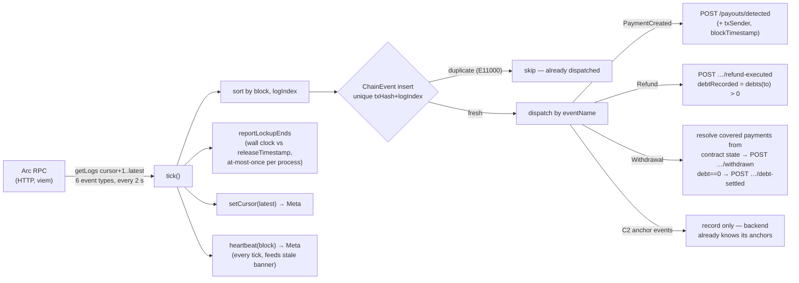

Watched events — C1: `PaymentCreated`, `Refund`, `Withdrawal` (not `RefundToUpdated`/`WithdrawalFeePaid` — GAP-I5); C2: `ReceiptAnchored`, `CaseOpened`, `DecisionAnchored` (record-only). The `Withdrawal` event names only the recipient, so covered payments are resolved from `payments(id)` contract state (FIN-26); refunds decide `debtRecorded` from a live `debts(recipient)` read.

### 12.2 Operational semantics

| Property | As built | Main-deployment target (§21.5) |
| --- | --- | --- |
| Transport | HTTP polling, 2 s (`INDEXER_POLL_MS`) | keep polling (Arc finality is sub-second); optional WS |
| Failure handling | tick error → exponential backoff ×2 capped 30 s; cursor untouched; heartbeat stalls → UI stale banner within 15 s (FIN-27) | same + alerting on stall |
| Idempotency | unique `{txHash, logIndex}` index; insert-and-catch-E11000 gates dispatch; replaying a range creates no duplicates (pinned by test) | unchanged — this is the correct core |
| Ordering | logs sorted by (block, logIndex) before dispatch | unchanged |
| Backend hook tolerance | 409 and 404 are expected chatter (the state machine is the authority; the indexer just reports); other non-2xx throws → backoff | + timeouts, retry budget |
| Cursor | Mongo `Meta` `indexer:cursor`, advanced only after the whole batch dispatches | unchanged |
| Finality / reorgs | **none** — reads to head, no confirmation depth, no reorg rewind (GAP-I1) | N-block confirmation lag + block-hash continuity check |
| Range chunking | none — cold start issues one unbounded getLogs (GAP-I2) | chunked backfill |
| Restart state | cursor/heartbeat/events survive; in-memory payment tracking (lockup/withdraw/debt derivation) does **not** (GAP-I3) | derive tracking from DB on boot |
| Keys | none; boot-fails on `/PRIVATE_KEY/i`; `REFUND_PROTOCOL_ADDRESS` required at boot | unchanged |

---

## 13. Proof Agent specification (C5)

### 13.1 Behaviour

Loop: every 3 s (`AGENT_POLL_MS`), fetch `GET /cases` + `GET /config`; for each non-CLOSED case fetch the shared body and compute findings; write a brief **only when findings changed** (exact-JSON comparison against the latest stored version — quiet ticks write nothing, satisfying the T1/T2/T3 trigger model: new case, new evidence, new reply each produce a new version; prior versions are retained immutably). Startup line states the contract: *"findings only, no keys"*.

### 13.2 The deterministic check engine (seven checks, PRD §11.2)

Pure function `runChecks(snapshot) → {checks, inconsistencies, missingItems}`; every check emits `{check, expected, found, result: pass|fail|missing}` with human-readable expected/found values (both figures always shown — the brief must read cold):

| # | Check | Logic | Demo outcome (2-of-3 case) |
| --- | --- | --- | --- |
| 1 | Payment matches work order amount | equals the order total or one of its tranche shares; no order → `missing` + missing-item "a work order binding this payment to agreed work" | pass (33.34 ∈ tranches of 100/3) |
| 2 | Per-deliverable file on record | deliverable-type evidence matched to promised deliverables; absent → `missing` + two missing items (final file, delivery confirmation) | Video 1 ✓, Video 2 ✓, Video 3 **missing** |
| 3 | Delivered by due date | file's submission date ≤ deliverable due date (day granularity) | pass, pass, (skipped for missing file) |
| — | Rollup: uploaded vs promised | `found: "2 of 3"`, fail when short | **fail** — the demo's contested check |
| 4 | Payment recipient matches work-order recipient | on-chain `to` vs registered wallet | pass ⚠ see GAP-A1 |
| 5 | Refund address matches platform registered address | on-chain `refundTo` vs platform registration | pass |
| 6 | Dispute opened inside the window | `openedAt` ≤ `disputeDeadline` | pass |
| 7 | Allegation supported by evidence | ≥ 1 non-deliverable item; else `missing` (never `fail` — absence of evidence is a gap, not a verdict) | pass |

Inconsistency rule (exactly one, deliberately narrow): if a reply exists **and** a deliverable file is missing, emit *"The response states the work was delivered; no file or delivery confirmation for {name} appears in the evidence record."* — the agent names the tension; the human resolves it.

### 13.3 The three-layer guardrail (P1, D8, FIN-45)

1. **Schema**: no recommendation field exists in `AgentBrief`; `FORBIDDEN_KEY_PATTERN` (`recommend|verdict|outcome|decision|approve|reject|refund|suggest|advis|conclusion|ruling`, case-insensitive) rejects keys recursively at any depth → 422; check fields are allow-listed to exactly `{check, expected, found, result}`; the agent test additionally asserts the findings **prose** contains no verdict words.
2. **Capability**: no chain or DB library is importable (CI test walks every source file against 9 forbidden tokens); runtime dependencies pinned to exactly `['@finne/domain']`; REST-only via the `agent_service` seat whose permission set (5) excludes evidence, responses, info requests and decisions.
3. **Environment**: boot-fail on `/(PRIVATE_KEY|MNEMONIC|SEED_PHRASE|KEYSTORE)/i` — stricter than the backend's own rule; the demo orchestration hands the agent only `BACKEND_URL`.

Stretch S3 (LLM narrative, FIN-48) layers on top without weakening this: OpenAI paraphrase labeled "Summary", hard 5 s timeout, kill-switch — on any failure the brief renders from the deterministic table alone; a post-filter bans outcome words. The demo never depends on a model call.

---

## 14. Web application specification (C6)

### 14.1 Stack and shape

React 18 + Vite 6, plain JS/JSX (no TS, no router, no state library). One context provider (`state.jsx`) polls `GET /status` + `/payouts` + `/cases` every 3 s, plus the active case detail, receipt and (when enabled) the chain-event strip; any fetch failure renders per-screen error cards with retry; the 15 s indexer heartbeat drives a "showing last confirmed chain state" stale banner instead of a crash (§13.4 resilience — the app must survive a dead RPC). Screen switching is a string state (`effScreen`), no URL routing (deep-linking is a §21.6 item). Design system "Entente" (Slate Indigo #3C4C82, Hanken Grotesk + IBM Plex Mono) via CSS custom properties.

### 14.2 Seats and screens

Three selectable seats (reviewer → ledger; recipient → home; platform → transactions); the `agent` seat exists server-side only. Client seat-switching is presentation — authorization is always server-side via the session header. Screens (FIN-50–58):

| # | Screen | Seat | Key elements |
| --- | --- | --- | --- |
| 1 | Payout Ledger | reviewer | 4 stat tiles (protected/escrow sum · open disputes with oldest-reply countdown · resolved split · **arbiter reserve + debt chip**, live from chain), disputed-first table, stale/error/empty/loading states |
| 2 | Payout Receipt | shared | Two panes: "What the chain recorded" (amount, to, **refund address · fixed at payment time**, tx, payment ID, protection end — each with copy chip + explorer link) vs "What it was for" (work order, deliverable checklist, policy, dispute deadline, evidence fingerprints). **"Identical view" marker.** |
| 3 | Case Room | shared | Claim, directed info-request answer box, reply composer (right of reply), responses, evidence (+ synthetic "Payment record on Arc" row), agent brief v{n} table with ✓/○/✗, timeline, reviewer actions (request info with remaining-count, decide) — gated exactly like the server |
| 4 | Decision & Signing | reviewer | Claim/reply/brief summary; mandatory reason (options **locked** until ≥ 20 chars); four equal options, no default; consequence preview per outcome; two-stage confirm → wallet handoff → awaiting / sig_rejected (recoverable, decision text kept) / pending (tx hash) / failed / confirmed → auto-forward to final receipt. **No automatic-decision control exists.** |
| 5 | Recipient Home + Reply | recipient | Needs-your-reply banner with countdown, decided-outcome banners with full written reasons, payout list, withdraw affordance (points at the recipient's own wallet — "Finné never holds your money") |
| 6 | Final Receipt | shared | Receipt + outcome strip: decider, wallet, reasons, four fingerprints (refund tx · decision hash · receipt hash · registry anchor), scenario-B strip ("covered from the arbiter reserve … repaid from the payout of {date}"), print/PDF, "This record is permanent. Corrections are added, never edited." |
| 7 | Demo status strip | any (demo mode only) | Last 4 chain events, explorer-linked; absent outside demo mode |
| — | New payout (mock) | reviewer | Read-only pay-and-protect form teaching the tranche rule and fixed refund address; the real `pay` stays in the treasury wallet / console — Finné never holds the payer key |

### 14.3 Signing path (D1/D11)

**Real path** (browser wallet detected): decision response's `unsignedTx` → viem `writeContract` against the wallet's provider; chain mismatch handled by `switchChain` → `addChain` → retry (one-click wrong-network fix, FIN-60); user rejection is classified and recoverable without a lost decision; then `waitForTransactionReceipt` against the app's own RPC → confirmed → the **indexer** independently observes the `Refund` event and drives the backend confirmation (the UI forwards; it is not the source of truth).

**Simulation path** (no wallet, demo only): the same phase sequence with fixed delays, explicitly labeled "· simulated" at every step, terminating in `POST /demo/execute-refund`; a demo-controls selector can force wallet-rejection and tx-failure rehearsal states. With a chain attached the real confirmation always wins (D11).

Known web-layer defects for the hardening backlog: hardcoded info-request cap duplicating the domain constant, `nativeCurrency.decimals: 18` on the wallet chain config vs USDC's 6, stale `web/README.md`, `window.prompt`-based dispute/evidence input, and stub Withdraw/Export buttons (GAP-W1..W5, Appendix E).

---

## 15. End-to-end flows

### 15.1 Protected payout → receipt → anchor (FIN-28/33/36; target: receipt in the API within 5 s of pay)

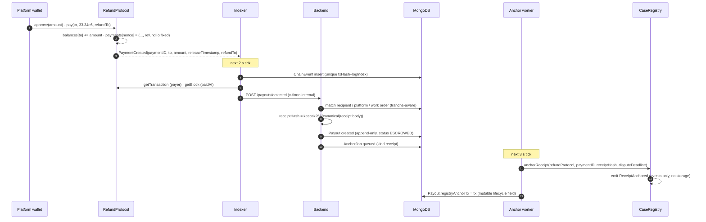

### 15.2 Dispute → notice → brief → right of reply

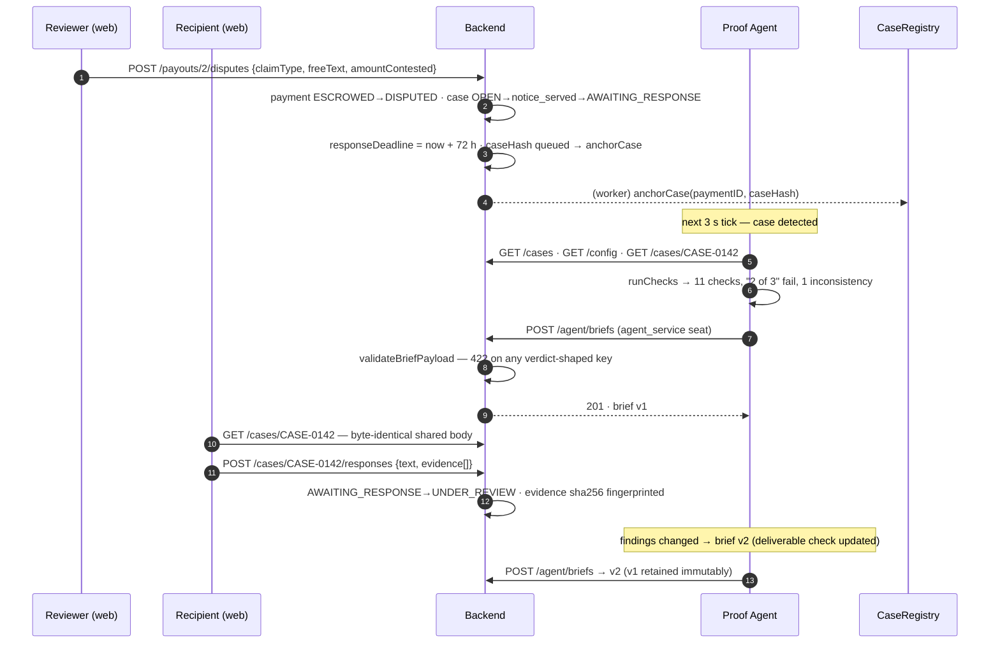

### 15.3 Human decision → wallet signature → on-chain refund → final receipt

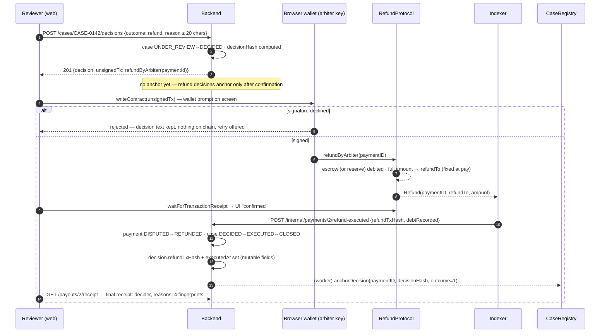

### 15.4 Scenario B — post-escrow clawback (the debt path, D3 core scope)

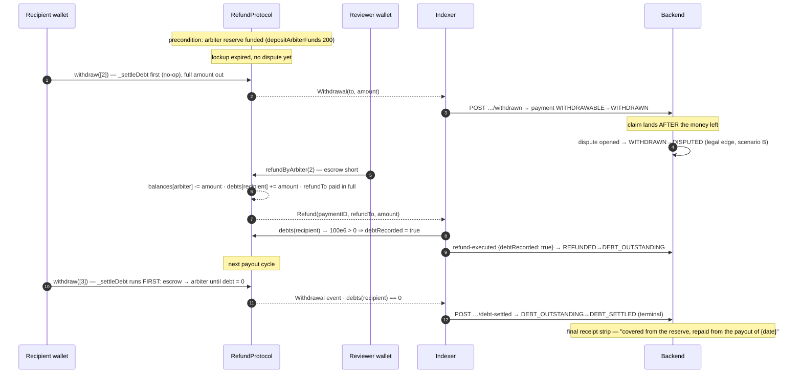

All three correction legs are native contract behaviour with zero contract changes: voluntary refund, small reserve, next payout.

---

## 16. Security architecture

### 16.1 Key custody matrix (normative)

| Key | Custody | May sign | May never | Enforcement |
| --- | --- | --- | --- | --- |
| Payer (platform) | Platform treasury / console env only (gitignored `contracts/.env`) | `approve`, `pay` | exist in any Finné service env | backend boot-fail; CI secret scan |
| Arbiter (reviewer) | Reviewer's browser wallet; console for proofs | `refundByArbiter`, `setLockupSeconds`, `depositArbiterFunds`, `withdrawArbiterFunds` | exist in any Finné service env | backend + agent boot-fail; D1 |
| Recipient | Recipient's own wallet | `withdraw`, `refundByRecipient` | exist in any Finné service env | backend boot-fail |
| Registry operator | **Backend env only** — the one Finné-held key | `anchorReceipt` / `anchorCase` / `anchorDecision` | touch C1 (structurally impossible: C2 has no transfer code; C1 has no operator role) | explicit exemption in `assertNoMoneyKeys`; agent still rejects it |
| (none) | Indexer, Agent | — | hold any key at all | dedicated boot assertions |

### 16.2 Boot-fail assertions (exact rules, FIN-11/FIN-45)

| Service | Rule (matches env var **names**, value-independent) | Error behaviour |
| --- | --- | --- |
| Backend | fails on `ARBITER_PRIVATE_KEY` / `PAYER_PRIVATE_KEY` / `RECIPIENT_PRIVATE_KEY`, or any name matching `/PRIVATE_KEY/i` except exactly `REGISTRY_OPERATOR_PRIVATE_KEY` | throw in `loadEnv` → `process.exit(1)` |
| Indexer | any name matching `/PRIVATE_KEY/i` — no exemptions | same |
| Agent | any name matching `/(PRIVATE_KEY\|MNEMONIC\|SEED_PHRASE\|KEYSTORE)/i` — no exemptions | same |

All three are unit-tested, run as the **first** statement of config loading, and are asserted in the backend suite with the exact demo keys. Gap: the backend/indexer patterns do not cover mnemonic/keystore names — align all three to the agent's stricter pattern (GAP-S1).

### 16.3 Threat model (STRIDE over the v1 attack surface)

| Threat | Vector | Current control | Residual risk → workstream |
| --- | --- | --- | --- |
| Spoofing (user) | Forged `x-finne-session` header — any caller can claim any seat | none beyond header naming a seeded identity (D7: demo-grade by decision) | **Critical for main deployment** → §21.1 IdP + signed sessions |
| Spoofing (service) | Forged `x-finne-internal` calls fabricating chain facts (fake refund-executed) | shared token; default `dev-internal`; non-constant-time compare | §21.2: strong secret, constant-time compare, network isolation, or mTLS/HMAC; ultimately verify facts against the chain |
| Tampering (records) | Editing decisions/evidence/receipts in place | append-only model hooks (409), computed timeline, on-chain hash anchors make silent edits detectable | close raw-driver bypass via DB permissions + schema validation (§21.3) |
| Tampering (chain data) | Reorg or RPC lies feeding false status | none (no finality buffer, no reorg rewind — GAP-I1); UI shows staleness, not correctness | §21.5 confirmation depth + block-hash continuity + trusted RPC set |
| Repudiation | Reviewer denies a decision | decision binds name + wallet + reason + timestamp; `decisionHash` anchored on chain; refund tx signed by the arbiter wallet itself | strengthen: bind session identity cryptographically at §21.1 |
| Information disclosure | Case/evidence content to wrong parties | content never on chain (hashes only); `/config` withholds payWallet; `fileOrText` never in receipts | **No per-seat data scoping** (any seat reads all cases/payouts — GAP-B1) → §21.3 tenancy scoping; TLS everywhere in §21.2 |
| Denial of service | 4 MB JSON bodies; unbounded evidence text; open public routes; agent tick serialization | body limit only | rate limits, payload caps per field, upload offloading (§21.2/§21.6) |
| Elevation of privilege | Agent seat writing verdicts; operator key moving money | 3-layer agent guardrail (§13.3); operator structurally hash-only; RBAC single choke point | keep the guardrail tests as permanent CI gates |
| Supply chain | Vendored contract drift; dependency tampering | PROVENANCE.md pins commit; libs pinned by tag+rev in `foundry.lock`; `--frozen-lockfile` in CI; gitleaks full-history | add SCA/pin auditing (§21.8); track Circle's `earlyWithdrawByArbiter` fix (R-1) |

### 16.4 Privacy posture

Chain carries hashes, payment IDs, addresses and a 1–3 outcome code — nothing else (verified against C2 calldata). Names, files, messages and reasons stay in Mongo. Demo data is fictional (JH-authored, Mom-Test-read). For the main deployment: data-retention policy, right-to-erasure handling (erasing DB content leaves only non-reversible hashes on chain — this is the designed-for outcome; document it as the GDPR story), and encryption at rest (§21.3).

---

## 17. Non-functional requirements

Carried from v1.1 §13 with measured current values and main-deployment targets:

| NFR | v1.1 requirement | As built (measured/asserted) | Main-deployment target |
| --- | --- | --- | --- |
| Read-only invariant | No Finné component other than the reviewer's own wallet action can move USDC | 4-layer enforcement (§4.1); tested | unchanged — non-negotiable |
| Privacy | Chain carries hashes and identifiers only | verified against C2 calldata | + retention policy, encryption at rest |
| Auditability | Receipts and decisions append-only; corrections append | model-layer hooks → 409; anchored hashes | + DB-level validation; anchor completeness monitoring |
| Resilience | App survives a dead RPC: stale marker, no crash | chainRead degrades to null; 15 s stale banner; indexer backoff; anchor queue never blocks user paths | + SLOs, alerting, multi-RPC failover |
| Latency | Refund confirmation in UI within 5 s of signing; receipt within 5 s of pay | 2 s indexer poll + 1 s blocks + 3 s UI poll on the fork; Arc finality sub-second | p95 receipt < 5 s; p95 confirm < 5 s, monitored |
| Honesty | Testnet/unaudited statements in README, deck, video | present verbatim | maintained until audited-rail milestone |
| Availability | (demo: one-command reseed under 2 min, 3 consecutive clean runs) | `make demo-reset` measured < 2 min | 99.9 % API; RPO ≤ 5 min, RTO ≤ 30 min |
| Scale | single platform, seeded seats | single-tenant | Phase-2 sizing: 10³ platforms, 10⁵ payouts/mo, 10³ concurrent cases (§21.3 indexes + scoping designed for this) |

## 18. Deployment architecture and environments

### 18.1 Topology (as built — local fork; identical shape on Arc testnet with real RPC/wallets)

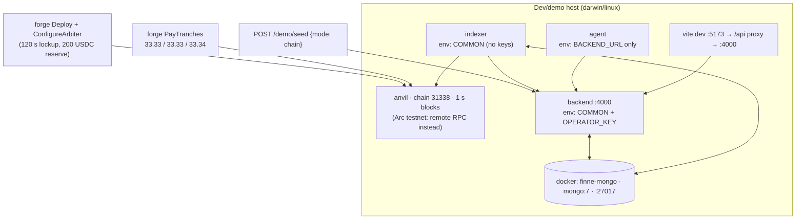

`make demo-reset` (FIN-66) executes exactly this sequence — kill previous, mongo up, anvil up, deploy, configure arbiter, start services (pids/logs under `.demo/`), health-gate on `/healthz` (30×1 s), seed base entities, execute the three tranche pays on chain. Verified demo-ready in under two minutes. `make demo-stop` tears down. Anvil dev keys 0–3 map to payer / Maya / Dana-arbiter / registry-operator — public keys, local only.

### 18.2 Environment variable contract (complete)

| Var | Consumer(s) | Default | Notes |
| --- | --- | --- | --- |
| `ARC_RPC_URL` | backend, indexer, → browser via /config | `http://127.0.0.1:8545` | |
| `ARC_CHAIN_ID` | backend (→ wallet switch-chain), demo-reset | `31338` | |
| `ARC_CHAIN_NAME` | indexer (stamped on payments) | `arc-testnet` (`arc-local` in demo) | |
| `ARC_EXPLORER_URL` | backend → UI links | placeholder | |
| `REFUND_PROTOCOL_ADDRESS` | backend (nullable), indexer (**required — boot-fail**), browser | — | |
| `CASE_REGISTRY_ADDRESS` | backend, indexer (both nullable — anchoring/watching skipped) | — | |
| `USDC_ADDRESS` | backend `/config` | — | |
| `REGISTRY_OPERATOR_PRIVATE_KEY` | backend only | — | the single permitted key; without it anchors queue indefinitely (warned at boot) |
| `MONGO_URL` | backend, indexer | `mongodb://127.0.0.1:27017/finne` | |
| `BACKEND_PORT` / `BACKEND_URL` | backend / indexer, agent, vite proxy | `4000` / `http://127.0.0.1:4000` | |
| `INTERNAL_TOKEN` | backend, indexer | `dev-internal` | **undocumented in `.env.example` — fix; must be strong + rotated in production** |
| `INDEXER_POLL_MS` / `INDEXER_START_BLOCK` | indexer | `2000` / `0` | `Number()` without NaN guard (GAP-I4) |
| `AGENT_POLL_MS` / `AGENT_VERSION` | agent | `3000` / `finne-proof-agent/0.1` | |
| `DEMO_MODE` | backend | **`true`** — only literal `'false'` disables | **must be `false` in production**: gates destructive `/demo/seed` and fabricated `/demo/execute-refund` (GAP-S2) |
| `RESPONSE_WINDOW_HOURS` | backend | `72` | fallback when platform policy absent; undocumented |
| Money keys (`PAYER/ARBITER/RECIPIENT_PRIVATE_KEY`) | console scripts only | — | documented-never-set; boot-fail elsewhere |
| Deploy-script vars (`DEPLOYER_PRIVATE_KEY`, `ARBITER/OPERATOR/PAYER/RECIPIENT_ADDRESS`, `LOCKUP_SECONDS`, `RESERVE_AMOUNT`, `REFUND_TO_ADDRESS`) | forge scripts | per script | |
| `AGENT_MONGO_URL` | **nobody** — vestigial (D8 removed the DB path) | — | delete from `.env.example` (GAP-O1) |

### 18.3 Seeded demo world (FIN-39/65, D5)

Frozen fixtures (`seed/src/fixtures.ts`, JH-owned content): Northbeam Studios ↔ Maya Reyes; work order "Three product videos — spring launch", 100 USDC, three deliverables (due 30 Jun / 7 Jul / 12 Jul); videos 1–2 delivered with evidence, video 3 not; claim `work_not_delivered_in_full` contesting 33.34; Maya's expired-transfer-link reply; Dana's model written reason. Scenario A = dispute under review (or `withReply:false` → awaiting reply, for the live beat); Scenario B = lockup expired + withdrawn before the claim → reserve-covered refund + debt + repayment strip. Seeding is idempotent one-command, preserves the indexer heartbeat, and returns the contested `caseId`/`paymentIds` for UI focus.

### 18.4 Toolchain pins (build-breaking if loosened — see memory of failures)

Node **22.14.0** via `.npmrc use-node-version` (system Node 25 crashes tsc); pnpm 10 workspaces; mongoose **exactly 8.9.5** (8.24.x type-inference stack-overflows tsc on these schemas — D9; schemas also use explicit `new Schema<any>()`); TS 5.7 with `noEmit` (packages consumed as source via `exports`); forge-std v1.16.2 + OZ v5.6.1 pinned clones (D10); solc 0.8.28; viem ^2.23.2; vitest ^3.0.5. When restarting services manually, export env vars individually — zsh does not word-split an env-blob variable (a broken boot shows `chain: null` in `/status`).

## 19. CI/CD and testing strategy

### 19.1 Current pipeline (`.github/workflows/ci.yml` — green is the FIN-45/FIN-61 acceptance)

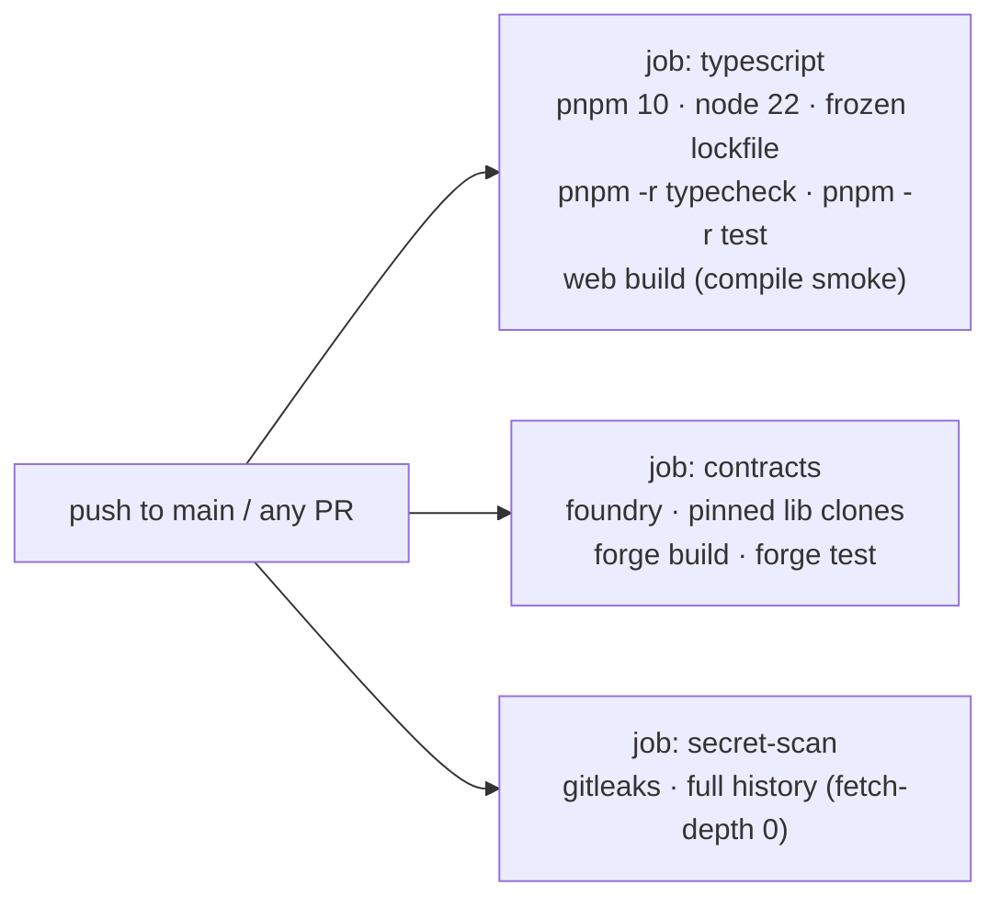

### 19.2 Test inventory (72 tests, all green)

| Suite | Count | Load-bearing assertions |
| --- | --- | --- |
| `contracts` Foundry | 10 (+40 vendored upstream) | debt path ledger math at every step; lockup gating; tranche isolation; unfunded-reserve revert; registry access control + outcome bounds |
| `packages/domain` | 22 | case machine incl. max-2 loop and decide-gating; payment machine **exhaustive negative sweep** (every illegal from×event pair throws, plain-language messages); findings guard rejects verdict keys at 3 depths |
| `packages/canonical` | 12 | golden vectors frozen across releases; canonicalization edge cases (undefined elision, non-finite rejection, class-instance rejection) |
| `backend` | 20 | key-hygiene boot-fail; seed shape; RBAC 401/403 + **byte-identical** shared case; dispute flow, unsolicited-reply 409, max-2 loop, short-reason 400; refund decision returns correct unsignedTx; execution confirmation closes the loop; append-only 409s on save and update; brief 422 smuggled-recommendation; receipt idempotency + no-work-order path |
| `indexer` | 7 | replay-no-duplicates (FIN-25 acceptance); withdrawal resolution from contract state; debtRecorded flag + settlement; lockup at-most-once; heartbeat liveness; key-hygiene |
| `agent` | 13 | guardrail import ban; single-dependency pin; boot-fail; the 2-of-3 demo case checks exactly; verdict-free prose; edge cases (no work order, refund-address mismatch, late delivery) |

### 19.3 Required additions for the main deployment (test debt, prioritized)

1. Backend routes currently uncovered: `/status`, `/config`, `/session`, `/chain/events`, work orders, direct dispute-open, the three remaining internal hooks, `GET /agent/briefs`, scenario-B seed, `/demo/execute-refund`.
2. Anchor worker unit tests (retry/failure/dead-letter once §21.4 lands) and adapter-layer indexer tests (E11000 path, hook 409/404 tolerance, backoff), plus reorg simulations after §21.5.
3. Web: component tests for the decision gate (reason ≥ 20, no default option) and signing phase machine; Playwright smoke over the seeded loop. A `pnpm -r lint` target that actually exists (root script currently no-ops — GAP-O2).
4. E2E: promote `demo-reset` + scripted API walk into a CI-nightly integration job against an ephemeral anvil.

## 20. Observability and operations

**As built**: `[backend]`/`[indexer]`/`[agent]`/`[anchor-worker]` prefixed console logs to `.demo/*.log`; `/healthz` liveness; `/status` as the single operational read (heartbeat age, last block, live reserve/debt); the UI stale banner as the user-facing degradation signal; `.demo/*.pid` process management.

**Main-deployment requirements (§21.8)**: structured JSON logs with request IDs; metrics — indexer lag (blocks + seconds), anchor queue depth and failure count (a `failed` job is currently **terminal and silent** — must page), hook error rates, brief-write rejections (a 422 spike means someone is probing the verdict guard), state-transition 409 rates; tracing across the indexer→backend→worker path; alert on heartbeat stall > 30 s, anchor failure, boot-loop. Runbooks to write: RPC failover, indexer restart-with-backfill, anchor requeue, seed/restore, key rotation (operator + internal token).

## 21. Production hardening roadmap (main-deployment workstreams)

Each workstream lists its gap references (Appendix E). Sequencing: PH-1/PH-2 unblock any real-user exposure; PH-5 unblocks trust in chain-derived state; the rest parallelize.

**PH-1 · Identity and access (replaces D7).** IdP integration (OIDC) at the `resolveSession` single swap point; sessions become verified, expiring credentials; per-platform user↔role binding; audit log of privileged actions. RBAC matrix and route guards carry over unchanged. [GAP-B2]

**PH-2 · Transport and internal-channel security.** TLS everywhere; strong rotated `INTERNAL_TOKEN` with constant-time compare (or mTLS/HMAC-signed hooks); rate limits; per-field payload caps; `DEMO_MODE=false` enforced by deploy config with a startup assertion in production profiles. [GAP-B3, GAP-S2]

**PH-3 · Tenancy and data scoping.** Real per-seat filters (recipient sees own payouts/cases; platform sees own tenant) replacing the no-op filter; multi-platform data model (the schema already keys everything by `platformKey` — scoping is query-layer work); atomic counters for case numbers and brief versions; Mongo schema validation + restricted DB users closing the append-only bypass; indexes for scale (payouts by platform+paidAt, cases by platform+status). [GAP-B1, B6, B10, B11]

**PH-4 · Anchor pipeline reliability.** Job leasing (`findOneAndUpdate` claim) for multi-replica safety; real exponential backoff; dead-letter queue with alerting and a manual requeue route (`anchor:write` finally gets an HTTP surface); anchor-completeness reconciliation against C2 logs. [GAP-B5]

**PH-5 · Indexer correctness.** N-confirmation finality lag + parent-hash continuity check with cursor rewind on mismatch; chunked backfill; persistent payment tracking derived from DB on restart; NaN-guarded config; watch `RefundToUpdated` (a changed refund destination is dispute-relevant fact) and `WithdrawalFeePaid`. [GAP-I1–I5]

**PH-6 · Product completeness.** Real work-order creation UI replacing the mock pay form; evidence file upload (object storage + streaming hash) replacing inline text; URL routing/deep links; real withdraw flow via the recipient's wallet; notifications; policy templates; the deadline-passed scheduler (the internal route exists; nothing calls it on a timer — GAP-B13); fix agent check 4 by exposing the work-order recipient wallet in the shared body, and replace positional deliverable matching with declared linkage. [GAP-A1, A2, W1–W5]

**PH-7 · Contract and rail evolution.** Adopt Circle's fixed Refund Protocol release when published (R-1 gate for any mainnet talk); zero-address check in the registry constructor; per-platform arbiter configuration path toward the neutral arbiter-of-record; optional Circle Wallets (S2/FIN-62) as a platform-choice signing backend behind the same unsigned-tx interface; second-rail adapter proving the registry's `refundProtocol` field. [GAP-C1, R-1]

**PH-8 · Operations.** Managed Mongo (Atlas) with backups meeting RPO/RTO; container images + IaC replacing `.demo` process management; the observability stack of §20; SCA and dependency-pin auditing in CI; staging environment mirroring Arc testnet config. [GAP-O1–O3]

## 22. Risks

| ID | Risk | Odds | Impact | Mitigation |
| --- | --- | --- | --- | --- |
| R-1 | Upstream `earlyWithdrawByArbiter` drain bug (Circle-acknowledged) | certain (exists) | reputational if misread; nil in v1 (function unused, arbiter = platform refunding itself) | never wire it; track Circle's fix; re-vendor with provenance; hard gate for mainnet |
| R-2 | Arc testnet instability during recording/judging | medium | demo failure | local fork rehearsal (identical chain id path); stale-state fallbacks; record against seeded env; capture explorer proof early |
| R-3 | Forged internal hooks in any exposed deployment | high until PH-2 | fabricated chain facts | network isolation now; PH-2 hardening; chain-verified facts later |
| R-4 | Seeded-session auth mistaken for real auth | high if v1 exposed publicly | full data/action exposure | never expose v1 beyond demo; PH-1 before any pilot |
| R-5 | Reorg/finality gap corrupts status or receipts | low on Arc (fast finality), higher elsewhere | wrong statuses; wrong receipts | PH-5 before any chain with meaningful reorg risk |
| R-6 | Canonicalization drift breaks anchored-hash verifiability | low | audit-trail claim collapses | golden vectors frozen; treat as versioned interface; migration plan required for any change |
| R-7 | Scope creep into the agent (pressure to "just recommend") | high | P1 collapse — the product's differentiator inverts | guardrails are CI gates; any change is a founder-level decision |
| R-8 | Two builders, calendar-bound deadlines | high | hackathon milestones slip | issue-list cut order stands: stretch first, polish second, never the money path |

## 23. Open decisions and dependencies

| ID | Item | Owner | Due / status |
| --- | --- | --- | --- |
| D2 | Ask Giles: does the read-only agent qualify for Agentic Economy as secondary track? | Arko | 31 Jul 2026 — open |
| D3-b | Presentation call: live scenario-B beat vs final-receipt still in the video | Arko | 6 Aug 2026 |
| — | Arc testnet faucet access + RPC/explorer endpoints confirmed (FIN-12) | Abhishek | blocks M1 |
| — | Browser-wallet extension holding arbiter key for live rehearsal (else labeled simulation per D11) | Abhishek | before 6 Aug |
| — | Circle fixed-release timeline for the early-withdrawal issue | external | monitor; gates PH-7/mainnet |
| — | Production IdP choice (PH-1) and hosting target (PH-8) | joint | main-deployment kickoff |

## 24. Appendices

### Appendix A — API quick reference

```
GET  /healthz · /config · /status · /chain/events · /session
POST /platforms/:key/workorders          GET /platforms/:key/workorders
POST /payouts/detected [internal]        GET /payouts · GET /payouts/:paymentId/receipt
POST /payouts/:paymentId/disputes        GET /cases · GET /cases/:id
POST /cases/:id/responses | /evidence | /requests | /decisions
POST /internal/payments/:id/refund-executed | /withdrawn | /lockup-ended | /debt-settled
POST /internal/cases/:id/deadline-passed
GET  /agent/briefs/:caseId               POST /agent/briefs [agent seat]
POST /demo/seed | /demo/execute-refund [demo mode, reviewer]
```

### Appendix B — Addresses and wallets

Local fork (chain 31338, deterministic): MockUSDC `0x5FbD…0aa3`, RefundProtocol `0xCf7E…0fc9`, FinneCaseRegistry `0xDc64…f6C9`; Anvil keys 0–3 = payer `0xf39F…2266`, recipient `0x7099…79C8`, arbiter `0x3C44…93BC`, operator `0x90F7…b906`. Arc testnet: all `_pending_` in `docs/addresses.md` until M1. EIP-712 domain: `"RefundProtocol"` / `"1"`.

### Appendix C — Decision log (D1–D11, normative)

D1 browser-wallet signing (Circle Wallets = stretch S2) · D2 open (track question) · D3 debt path core · D4 naming (Finné product / Finne Pay company) · D5 demo scenario 100 = 33.33+33.33+33.34, 3 promised 2 delivered · D6 one payment per deliverable (whole-payment refunds) · D7 RBAC over seeded sessions, no IdP for 9 Aug · D8 agent talks REST as a restricted seat, no DB credential, import ban · D9 mongoose pinned 8.9.5 · D10 pinned lib clones, not submodules · D11 labeled simulation when no wallet; indexer drives real confirmation when chained.

### Appendix D — Glossary

**Arbiter** — the C1 role empowered to refund; held by the platform's reviewer in v1. **Anchor** — writing a keccak256 canonical-JSON hash to C2. **Brief** — versioned agent findings; never a verdict. **Debt path / scenario B** — reserve-covered refund after withdrawal, repaid from the next payout. **Lockup** — per-recipient escrow window set at pay time. **Receipt** — the record binding a chain payment to work, terms and evidence. **Release** — refund rejection; funds become withdrawable at lockup end; no transaction needed. **Seat** — a seeded session identity. **Tranche rule** — one payment per deliverable (D6).

### Appendix E — Defect and gap register (verified against `1eb4bcc`)

| ID | Where | Finding | Severity → workstream |
| --- | --- | --- | --- |
| GAP-B1 | backend | No per-seat data scoping; recipient payout filter is a no-op (`$exists` on a required field) | High (prod) → PH-3 |
| GAP-B2 | backend | Header sessions: unauthenticated, unsigned, non-expiring (D7 by design) | Critical (prod) → PH-1 |
| GAP-B3 | backend | `INTERNAL_TOKEN` default `dev-internal`, non-constant-time compare, undocumented | High → PH-2 |
| GAP-B5 | anchorWorker | No backoff (header comment claims it), no job leasing (replica double-anchor), silent terminal `failed` after 8 attempts | High → PH-4 |
| GAP-B6 | models | `Payout.status`/`Case.status` lack enum; state machine is the only guard; raw-driver bypass of append-only hooks | Medium → PH-3 |
| GAP-B10 | services | `nextCaseNumber`/brief version from `countDocuments` — collision-prone | Medium → PH-3 |
| GAP-B11 | services | Global evidence (`payoutRef:null, caseRef:null`) appears on every receipt/case | Medium → PH-3 |
| GAP-B12 | domain/backend | `lockup_end_after_clear` edge defined but never emitted | Low → PH-6 |
| GAP-B13 | backend | `deadline-passed` route exists; no scheduler calls it | Medium → PH-6 |
| GAP-A1 | agent | Check 4 compares `/config` recipient wallet with itself (shared body lacks `recipientWallet`) — cannot detect mismatch in production | High → PH-6 |
| GAP-A2 | agent | Deliverable↔evidence matching positional/time-sorted, not name-matched | Medium → PH-6 |
| GAP-I1 | indexer | No finality buffer, no reorg handling | High (prod chains) → PH-5 |
| GAP-I2 | indexer | Unbounded cold-start getLogs | Medium → PH-5 |
| GAP-I3 | indexer | In-memory payment tracking lost on restart (lockup/withdraw/debt derivation) | Medium → PH-5 |
| GAP-I4 | indexer | `Number()` env parsing without NaN guards | Low → PH-5 |
| GAP-I5 | indexer | `RefundToUpdated`/`WithdrawalFeePaid` unwatched | Low → PH-5 |
| GAP-S1 | env asserts | Backend/indexer key patterns miss MNEMONIC/SEED_PHRASE/KEYSTORE (agent covers) | Medium → PH-2 |
| GAP-S2 | backend | `DEMO_MODE` defaults **true**; gates destructive seed + fabricated refunds | High (prod) → PH-2 |
| GAP-C1 | registry | No zero-address check on constructor `operator` | Low → PH-7 |
| GAP-W1 | web | Info-request cap hardcoded (should import `MAX_INFO_REQUESTS`) | Low → PH-6 |
| GAP-W2 | web | Wallet chain config `decimals: 18` for USDC (6) | Low → PH-6 |
| GAP-W3 | web | `web/README.md` stale (contradicts current app) | Low → docs pass |
| GAP-W4 | web | `window.prompt` dispute/evidence input; stub Withdraw/Export buttons | Medium → PH-6 |
| GAP-W5 | web | No URL routing/deep links; unused `api.brief()` | Low → PH-6 |
| GAP-O1 | ops | `.env.example` drift: `AGENT_MONGO_URL` vestigial; `INTERNAL_TOKEN`/`RESPONSE_WINDOW_HOURS`/`ARC_CHAIN_NAME` undocumented; `seed/src/run.ts` script dead | Low → PH-8 |
| GAP-O2 | ops | Root `lint` script no-ops (no package defines lint); web has no tests | Medium → §19.3 |
| GAP-O3 | ops | demo-reset greps deploy-log prefixes (format is an implicit interface) | Low → PH-8 |

---

*Finné · Build on Arc · engineering working document. Circle's Refund Protocol is unaudited, carries no security guarantees, and is released for educational purposes under Apache 2.0. This build runs on Arc testnet only.*
